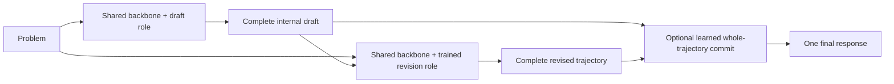

# Shohin

Shohin is a research program for **model-owned temporal revision**: a
pretrained language model first writes a complete solution draft, then a
separately trained role state of the same backbone reads the problem and that
exact draft and emits one coherent revised trajectory.

The project is no longer primarily a plan to pretrain another small model from
scratch. Its central question is whether a learned draft/revision/commit
computation can improve existing models across scale, family, and sparse
Mixture-of-Experts architectures under matched controls.

## Current status

The dense-model effect is established at aggregate level:

| Host | Trained revision | Matched unchanged pass | Gain |
|---|---:|---:|---:|
| Qwen3.5-0.8B holdout | `328/1279` | `242/1279` | `+6.72 pp` |
| Qwen3.5-4B holdout | `554/1279` | `380/1279` | `+13.61 pp` |
| Qwen3.5-9B holdout | `625/1279` | `495/1279` | `+10.16 pp` |
| SmolLM3-3B development | `469/1289` | `358/1289` | `+8.61 pp` |

The strongest 9B protected product system moves from `316/538` for the
unchanged same-family second pass to `374/538` with trained revision and
`383/538` with learned whole-trajectory commitment. Five-domain macro accuracy
moves from `67.263%` to `75.815%`.

Capability preservation is not universal. The 0.8B and SmolLM3 experiments
regress executable code, and the 4B protected product gains 48 answers overall
while regressing several small domain counts. Shohin therefore claims a real
learned temporal-revision effect, not universal reliability or frontier
reasoning.

## Current blocker: MoE transfer

The first sparse host is `OLMoE-1B-7B-0125-Instruct` with 64 experts and eight
active per token.

- **MTR1:** final-four-layer shared-attention LoRA, with router and experts
  frozen, reaches `204/1289` versus unchanged `191/1289`. Mean all-layer route
  drift is only `0.002018`.
- **RCR1:** a direct bounded residual on the final four router logits reaches
  `194/1289`, versus `191/1289` for both matched attention and unchanged, and
  remains below MTR1.

These experiments reject two narrow ports of the dense mechanism. They do not
show that temporal revision is incompatible with MoE. The current work is
attributing corrected, broken, persistent-wrong, and preserved-correct cases
to routing behavior before freezing one draft-conditioned multi-token sparse
controller with matched router-only, expert-only, attention, and draft-masked
controls.

No larger-MoE capability campaign is authorized until a mechanism passes the
small host's development and sealed-holdout gates.

## Architecture in one diagram

At inference the system receives no verifier output, correctness bit,
benchmark label, external proposal, symbolic solver, or task-specific route.
Matched experiments distinguish learned use of the model's own draft from an
unchanged second pass, generic self-refinement, longer generation,
best-of-two, and draft-masked training.

## Read in this order

1. **[SHOHIN.md](SHOHIN.md)** — current architecture, evidence, limitations,
   and leading MoE direction without the historical archive.
2. **[MoE frontier consultation brief](docs/research/SHOHIN_MOE_FRONTIER_CONSULTATION_BRIEF_20260809.md)** —
   self-contained technical problem statement for external architecture
   review.
3. **[Transferable temporal revision contract](docs/research/SHOHIN_TRANSFERABLE_TEMPORAL_REVISION_CONTRACT.md)** —
   exact changed factor, controls, data boundaries, and promotion rules.
4. **[MTR1](docs/research/SHOHIN_MTR1_SMALL_MOE_TRANSFER.md)** and
   **[RCR1](docs/research/SHOHIN_RCR1_REVISION_CONDITIONED_ROUTING.md)** — the
   two completed small-MoE failure boundaries.
5. **[Native reasoning master ledger](SHOHIN_NATIVE_REASONING_MASTER.md)** —
   complete research history, including negative experiments.
6. **[Agent runbook](AGENT_RUNBOOK.md)** — current operational state and
   immutable experiment receipts.

## Evidence policy

Shohin separates architecture ideas, mechanics receipts, development results,
sealed holdouts, and publication claims. A mechanism does not advance because
it is elegant, trains successfully, or fits in memory. It advances only when
it beats matched controls on source-disjoint data under frozen gates, preserves
required domains, and records exact model/data/runtime provenance.

Historical ETTR compiled-state, synthetic law-induction, and scratch-model
work remain in the ledger because negative and bounded results matter. They
are not presented as the current Shohin architecture.
