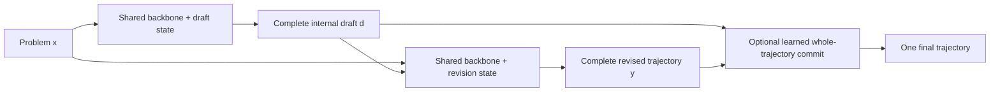

# Shohin: Model-Owned Temporal Revision

> Current architecture and evidence boundary — 2026-08-09

## Read this first

Shohin is now a **transferable reasoning architecture for pretrained language
models**, not primarily a plan to train another small decoder from scratch.
Its strongest demonstrated mechanism is **model-owned temporal revision**:

1. one role state of a pretrained model writes a complete solution draft;
2. a separately trained role state of the same model reads the original
   problem and that exact draft;
3. it emits one coherent replacement trajectory; and
4. an optional learned commit policy chooses one complete trajectory without
   mixing answer fields.

At inference there is no external proposal model, verifier, correctness bit,
benchmark router, symbolic solver, retrieval system, or teacher. The draft is
an internal computational artifact produced and consumed by the deployed
model family.

The architecture has produced large, source-disjoint gains on dense Qwen
models from 0.8B through 9B and a strong aggregate gain on dense SmolLM3-3B.
It has **not yet transferred strongly to a sparse Mixture-of-Experts (MoE)
host**. Small-OLMoE experiments show that late shared-attention adaptation,
static router-logit residuals, and shared post-MoE residuals weakly modulated
by native expert codes all provide at most modest gains. Giving each native
expert its own residual transform or routing among a new revision-only expert
bank performs worse than shared correction. The best current OLMoE arm is an
all-layer shared rank-18 post-MoE residual at `248/1,289`, versus unchanged
`191`; a token-causal persistent-state router reaches only `249`, with expert
top-1 routes changing on `0.0248%` of traced token/layer events. These are
useful modest effects but remain below the frozen capability threshold. The
small-OLMoE native-transfer lane is closed; larger-MoE scaling is not
authorized from this evidence.

Historical ETTR graph-reactor and synthetic compiled-state experiments remain
valuable research history, but they are not the current deployable Shohin
architecture. The complete historical ledger is
`SHOHIN_NATIVE_REASONING_MASTER.md`.

## The architecture

Let `G(theta, x, b)` denote bounded generation by a pretrained model with
parameters `theta`, prompt `x`, and generation budget `b`. Shohin installs two
small role states on a shared pretrained backbone:

```text
draft d    = G(theta + delta_draft, source, budget)
revision y = G(theta + delta_revision, source || exact_draft(d), budget)
final      = whole_trajectory_commit(d, y)
```

`delta_draft` and `delta_revision` are role-specific low-rank states rather
than independent full models. During revision training, the backbone and
draft owner are frozen. The revision state is trained on complete verified
target trajectories, not merely final answer labels. Deployment therefore
contains one backbone, two small role states, and a deterministic two-phase
controller.



### What is structurally different

A normal decoder makes one left-to-right commitment. Ordinary self-refinement
asks the unchanged model to try again. Best-of-two spends more inference
compute but does not learn how to use its own earlier trajectory. Shohin
instead trains a **role-specific later state** on the causal object created by
the earlier state.

The changed factor is not simply “more tokens” or “another LoRA”:

- the first pass externalizes a full tentative computation;
- the second role is trained specifically to diagnose and replace that
  computation;
- source and exact draft are jointly visible to the reviser;
- the revision is one coherent trajectory, never a fieldwise average;
- matched controls use the same host, draft, prompt, target-token budget, and
  evaluator; and
- source-disjoint identities and sealed holdouts separate training from
  evaluation.

The working interpretation is that the draft becomes a temporary writable
workspace. It exposes intermediate commitments that a later model state can
condition on, revisit, and correct. Evidence supports this interpretation at
the behavioral level: trained revision repeatedly beats an unchanged second
pass, generic self-refinement, longer generation, and draft-masked training.
It does not yet prove a unique internal algorithm or universal reliability.

The revision operator is deliberately one-shot in the qualified release. A
development-only test that applied the same 9B reviser twice fell from
`589/1,289` to `539/1,289`: 15 errors were repaired, but 65 correct answers were
broken. Recursive inference depth therefore requires a separately trained
later owner plus an earned retention mechanism; blindly repeating the current
reviser is closed.

### Whole-trajectory commitment

At 9B, a learned model-owned commit stage compares two complete same-family
trajectories and selects one. The useful result is the learned commit policy,
not the specific antisymmetric scoring form: an antisymmetric relational head
beat a matched independent scorer by only one answer, below the frozen causal
margin. Shohin therefore claims coherent learned commitment, not a distinct
antisymmetry discovery.

## Measured dense-model evidence

All rows below compare trained revision against the matched unchanged second
pass over source-disjoint identities unless noted otherwise.

| Dense host | Development | Holdout | Qualified boundary |
|---|---:|---:|---|
| Qwen3.5-0.8B | `323/1289` vs `236/1289` (`+6.75 pp`) | `328/1279` vs `242/1279` (`+6.72 pp`) | aggregate gain; code `8` vs `9` fails strict retention |
| Qwen3.5-4B | `529/1289` vs `371/1289` (`+12.26 pp`) | `554/1279` vs `380/1279` (`+13.61 pp`) | every attribution domain positive |
| Qwen3.5-9B | `589/1289` vs `464/1289` (`+9.70 pp`) | `625/1279` vs `495/1279` (`+10.16 pp`) | every attribution domain positive; original MATH promotion floor missed |
| SmolLM3-3B | `469/1289` vs `358/1289` (`+8.61 pp`) | sealed | cross-family aggregate gain; executable code `4` vs `9` fails retention |
| OLMo2-7B | `259/1289` vs `231/1289` (`+2.17 pp`) | sealed | positive but too weak to promote |

The 4B protected seven-task product board further tests whether a strong
source-disjoint gain is uniformly reliable. The trained reviser scores
`320/538` versus `272/538`, with macro accuracy `61.39%` versus `51.05%`.
However, GSM8K, MATH-500, and logic regress by two, one, and two answers while
science and code improve strongly. The aggregate result is substantial, but
the predeclared all-domain-nonregression gate correctly fails.

The strongest 9B product system adds a model-owned whole-trajectory commit:

| 9B product system | Solved | Five-domain macro |
|---|---:|---:|
| unchanged second pass | `316/538` | `67.263%` |
| trained revision | `374/538` | `75.005%` |
| learned whole-trajectory commit | `383/538` | `75.815%` |
| coherent oracle ceiling | `399/538` | `78.619%` |

This is the strongest practical Shohin result. It establishes useful
same-family draft/revision/commit computation on a dense 9B host. It is not a
claim that the original 125M scratch checkpoint is a frontier reasoner.

The complete system is now packaged as an immutable delta and has passed a
five-prompt end-to-end H100 smoke test. The package verifies the pinned base,
draft adapter, trained revision adapter, learned commit state, reports, and
product qualification before inference, then records all candidates and the
selected whole trajectory. See
[`docs/research/SHOHIN_IDR_AQC_DEPLOYABLE_RELEASE.md`](docs/research/SHOHIN_IDR_AQC_DEPLOYABLE_RELEASE.md).

## What did not work on dense hosts

Several negative results constrain the design:

- A generated KEEP/REVISE selector on OLMo2-7B scored `229/1289`, below both
  unchanged (`231`) and always-revise (`259`). Read-only attribution showed
  that a perfect selector could add only one answer beyond always-revise.
  Selection was not the bottleneck.
- An eight-step recurrent error-syndrome workspace scored `255/1289` versus
  `239` for its identical workspace control, demonstrating a small causal
  effect, but it remained below direct revision at `259` and regressed math
  and code. A latent correction-direction objective was not sufficient.

These failures point toward revision capacity and capability preservation,
not a larger output selector.

## The current MoE failure boundary

The first MoE host is pinned
`allenai/OLMoE-1B-7B-0125-Instruct`: 7B total parameters, approximately 1B
active parameters, 64 experts, eight selected per token, 16 decoder layers.
The exact same source-disjoint temporal-revision geometry was used.

### MTR1: shared-attention revision

MTR1 trained rank-8 LoRA only in shared attention projections of the final
four layers. Router and expert parameters remained frozen. It used 524,288
trainable parameters.

| Arm | Correct / 1289 | Accuracy |
|---|---:|---:|
| shared-attention temporal revision | `204` | `15.8262%` |
| unchanged second pass | `191` | `14.8177%` |
| generic self-refinement | `169` | `13.111%` |
| long single generation | `167` | `12.956%` |
| best-of-two | `134` | `10.396%` |
| draft-masked independent training | `189` | `14.6625%` |

The treatment improves every broad domain nonnegatively (`+1` math, `+12`
logic/science, `0` code), but gains only 13 answers / 1.01 points—far below
the frozen `+5 pp` and strongest-control `+3 pp` gates.

Router accounting is especially informative. Across 87 rows and 74,935
tokens, every expert is used and normalized route entropy remains about
`0.932`, yet trained-versus-base route-count L1 drift is zero in layers 0–11
and only `0.00184`, `0.00381`, `0.00709`, and `0.01955` in layers 12–15.
Mean all-layer drift is `0.002018`. The adapter changes some answers while
leaving sparse computation almost unchanged.

### RCR1: direct router-logit residual

RCR1 then trained a bounded rank-8 residual directly on the final four router
logits while freezing every base router and expert. It used 67,584 trainable
parameters and was compared with a 65,536-parameter rank-1 shared-attention
control under the same data and 256-update budget.

| Arm | Correct / 1289 | Accuracy |
|---|---:|---:|
| revision-conditioned router residual | `194` | `15.0504%` |
| matched rank-1 attention | `191` | `14.8177%` |
| unchanged second pass | `191` | `14.8177%` |
| prior rank-8 shared-attention MTR1 | `204` | `15.8262%` |

RCR1 adds only three answers and remains below MTR1. Exact RCR1 is closed.
The larger Qwen3.6-35B-A3B MoE campaign is not authorized merely because its
one-H100 NF4 mechanics fit; scaling a failed intervention would not identify
the missing mechanism.

## What the MoE result means

The evidence rules out two narrow hypotheses:

1. late shared-attention adaptation alone is enough to transfer dense
   temporal revision to this small MoE; and
2. a small, token-local, static residual on late router logits is enough.

It does **not** show that temporal revision is incompatible with MoE. Several
mechanisms remain unresolved:

- **Routing may already be adequate while experts lack revision-specific
  computation.** Redirecting a token among frozen experts cannot create a
  correction operation that none of those experts learned.
- **The controller may need memory across tokens.** Revision is a trajectory-
  level process, while RCR1 perturbs each router from the current hidden state
  independently. It has no persistent draft-diagnosis state.
- **The intervention may occur too late.** Restricting adaptation to four late
  layers cannot change expert selection or representation formation in the
  first twelve layers.
- **Top-k routing is discontinuous.** Small logit changes often leave the same
  eight experts selected; larger changes may destabilize load without
  producing useful specialization.
- **The small host may be capacity-limited.** Approximately 1B active
  parameters may be too weak to exploit the draft reliably even though 7B
  parameters exist in total.
- **Output loss weakly supervises routes.** A sequence-level correction target
  supplies a long credit-assignment path to thousands of discrete expert
  choices.

The current task is to distinguish these causes from existing completed
artifacts before training another mechanism. Outcomes are being partitioned
into corrected, broken, persistent-wrong, and preserved-correct cases and
correlated with per-layer route changes, expert overlap, entropy, and load.

## The leading MoE-native successor

The strongest current direction is a **draft-conditioned multi-token revision
controller**, contingent on the attribution above. It would summarize the
source/draft discrepancy into a persistent recurrent state and use that state
through multiple layers and output tokens to control both:

1. bounded router-logit deltas; and
2. small revision-specific expert-side low-rank adapters or a shared adapter
   basis whose coefficients are selected by the controller.

Conceptually:

```text
s_t = recurrent_controller(s_(t-1), source_state, draft_state, h_t)
router_logits' = router_logits + bounded_route_delta(s_t, h_t, layer)
expert_output' = expert_output + selected_low_rank_delta(s_t, h_t, expert, layer)
```

This is not yet a result or a frozen final design. Its purpose is to test the
missing interaction that MTR1 and RCR1 exclude: persistent trajectory-level
diagnosis plus revision-specific computation inside the sparse path.

A valid experiment must include matched controls:

- equal-budget dense shared-attention adaptation;
- router-only recurrent control;
- expert-adapter-only control;
- shuffled-draft or draft-masked controller;
- identical update/data/decoding budgets; and
- router utilization, entropy, expert overlap, active parameters, FLOPs,
  memory, latency, and accuracy-per-compute reporting.

The initial gate remains OLMoE development. Only a preregistered pass on both
overall margins and all-domain retention may open its sealed holdout and then
authorize a larger MoE host.

## Honest claim boundary

Shohin currently supports these claims:

- trained same-family draft-conditioned revision produces large aggregate
  gains on several dense pretrained models;
- the effect survives a 0.8B-to-9B Qwen scale intervention and transfers in
  aggregate to SmolLM3;
- a learned whole-trajectory commit improves the strongest 9B product system;
- capability preservation is not universal; and
- two plausible small-MoE interventions have failed under matched controls.

Shohin does not yet support these claims:

- reliable improvement in every domain or model family;
- successful temporal revision on MoE;
- open-domain frontier reasoning;
- a novel antisymmetric selector mechanism;
- a reasoning result from the old 125M Shohin checkpoint; or
- authorization for large-scale MoE training before the mechanism passes on
  the small host.

## Where to read next

- `docs/research/SHOHIN_MOE_FRONTIER_CONSULTATION_BRIEF_20260809.md` —
  self-contained MoE problem statement and design request.
- `docs/research/SHOHIN_TRANSFERABLE_TEMPORAL_REVISION_CONTRACT.md` — exact
  architecture and matched-control contract.
- `docs/research/SHOHIN_MTR1_SMALL_MOE_TRANSFER.md` — shared-attention MoE
  experiment.
- `docs/research/SHOHIN_RCR1_REVISION_CONDITIONED_ROUTING.md` — direct router
  experiment.
- `docs/research/DIVERGE_IDR1_INTERNAL_DRAFT_REVISION.md` and
  `docs/research/DIVERGE_AQC1_ANTISYMMETRIC_QUOTIENT_COMMIT.md` — strongest 9B
  revision and commitment evidence.
- `SHOHIN_NATIVE_REASONING_MASTER.md` — complete chronological ledger,
  including negative and historical work.
