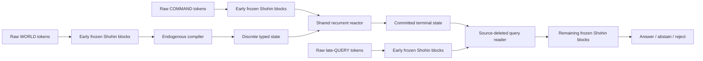

# Shohin: Endogenous Typed Theory Reactor

## What Shohin is now

Shohin is a **192.8M-parameter language model with an explicit, trainable
reasoning workspace**.  It retains a 125.1M-parameter causal transformer as
its language substrate, then adds a 67.7M-parameter **Endogenous Typed Theory
Reactor (ETTR)**.  ETTR forces the model to translate a described world into a
bounded, discrete typed graph; manipulate that graph through a small set of
generic transactions; and answer a later question using only the resulting
graph state.

The central architectural move is to make the model's intermediate world
state an actual, inspectable computational object rather than an implicit
pattern distributed across token activations.  The model must learn the
compiler and the controller itself.  There is no task-specific parser, rule
engine, search procedure, arithmetic routine, rewrite matcher, resource
scheduler, answer callback, or semantic host code in the candidate runtime.



The three streams are causally separated: the world is compiled before the
command phase; the world source is not available after compilation; and the
late query cannot access world tokens, compiler residuals, KV cache, parser
state, or the execution trajectory.

## The base language model

The underlying Shohin checkpoint is a compact, deep-and-thin decoder-only
transformer:

| Property | Design |
|---|---|
| Base parameters | 125,081,664 |
| Width / depth | 576 hidden width, 30 transformer blocks |
| Attention | 9 query heads and 3 KV heads (grouped-query attention) |
| Context / vocabulary | 2,048 tokens / 32,768 tokens |
| Core blocks | causal attention, RoPE, RMSNorm, SwiGLU, QK normalization |
| Embeddings | input/output embeddings tied |

ETTR taps the residual stream after block 20.  The remaining transformer
blocks remain the normal language decoder after the state-aware query reader
has injected its result.  This lets Shohin keep ordinary language modeling
while adding a distinct stateful computation path.

## The ETTR mechanism

### 1. Raw-token world compiler

The compiler cross-attends 64 learned anonymous object slots to the frozen
Shohin residuals for the WORLD text.  It emits a bounded typed graph, not a
continuous hidden-state cache:

- 64 object, relation, and value-node slots;
- one of 256 categorical value codes per active slot;
- one of 8 latent types per active slot;
- 16 directed relation roles;
- an edge ledger capped at 256 edges;
- activity and root indicators; and
- two terminal-status bits.

Ordered hyperedges and multi-byte values are represented by explicit reified
nodes, rather than silently encoding order or content inside a scalar edge
label.  At deployment, the packet rejects continuous value channels,
non-one-hot codes/types, non-binary control values, and over-capacity relation
ledgers.  This makes the handoff a finite state object with an auditable
schema, not a lossy text summary.

### 2. Generic transaction reactor

After the world is sealed, a six-layer recurrent controller reads the typed
state and a separate COMMAND stream.  It can issue only nine structural
actions:

```text
ALLOC  WRITE  CLEAR  LINK  UNLINK  SET_ROOT  COMMIT  HALT  REJECT
```

Those are intentionally *not* domain operations.  For example, the runtime
does not contain a Horn-clause opcode, a rewrite rule matcher, or a
resource-transition primitive.  Every operation only allocates/edits graph
cells, adds/removes typed directed edges, selects a root, or terminates.
Consequently, any theory-specific behavior must be encoded in the learned
compiler and recurrent controller, rather than delegated to a fixed executor.

At every step the reactor reconstructs slot features from categorical
value/type embeddings, activity, root, and terminal status.  Its relation
message bus is **endpoint-aware**: it aggregates separate incoming and
outgoing messages for every relation role.  This preserves *which* neighbor
is connected to which slot, solving the failure mode of degree-only graph
summaries that cannot distinguish different graphs with the same per-node
relation counts.

The controller has a 64-step bound.  `COMMIT`, `HALT`, and `REJECT` create four
explicit, always-visible dispositions:

| Status | Meaning |
|---|---|
| `OPEN` | execution may continue |
| `ANSWER` | committed answer state |
| `ABSTAIN` | halted without commitment |
| `REJECT` | committed contradictory/invalid state |

Once terminal, later structural updates are frozen.

### 3. Exact discrete execution with usable gradients

ETTR uses hard one-hot choices and capped binary edges in the forward pass.
The deployed state is therefore exact and discrete, while the corresponding
pre-discretization probability distributions remain on the backward path via
a straight-through estimator.  This is a deliberate hybrid:

- inference can be audited as a concrete sequence of graph transactions;
- training can still correct the compiler and controller with gradients; and
- the model cannot hide answer-bearing continuous vectors in the cross-stage
  packet.

### 4. Source-deleted late-query reader

The query reader receives only the terminal typed state and the raw QUERY
tokens.  It cannot revisit the WORLD text or reuse compiler activations.  It
builds state features from all declared fields—values, types, active/root
flags, disposition, and endpoint-aware incoming/outgoing relation messages—
then cross-attends the causal query representation to those features.  Its
state-derived residual is added back to the query stream before Shohin's final
decoder blocks produce language tokens.

This creates an explicit bottleneck: a correct later answer has to be
recoverable from the finite state object, not from an accidental source-text
shortcut.

## Why this differs from a standard transformer

| Standard decoder-only transformer | Shohin with ETTR |
|---|---|
| Keeps all task state implicitly in contextual activations and KV cache | Compiles an explicit bounded typed graph with discrete deployed fields |
| Interleaves source, instructions, and question in one attention context | Enforces `WORLD -> COMMAND -> QUERY` causal stages and source deletion |
| Produces next tokens directly | Performs a recurrent sequence of inspectable structural transactions before answering |
| Uses learned attention patterns as its only relational substrate | Uses an endpoint-aware, typed directed relation ledger plus message bus |
| Has no architectural representation for uncertainty disposition | Carries explicit `ANSWER`, `ABSTAIN`, and `REJECT` terminal states |
| Can rely on textual coincidences across a prompt | Must pass through a source-free packet whose schema excludes text, offsets, residuals, caches, and answer labels |
| Typically applies soft continuous activations end-to-end | Executes hard categorical/state transitions while retaining corrective gradient paths |

The intended result is not simply “a transformer with more parameters.”  It
is a language-conditioned compiler, state machine, and state-conditioned
reader trained as one differentiable system.

## Training and causal safeguards

ETTR's continuation contract treats each example as three independently
bounded segments: `WORLD`, `COMMAND`, and `QUERY`.  Language-model targets do
not cross segment boundaries.  The objective combines:

- initial-packet and free-running terminal-packet supervision;
- transaction supervision;
- initial and terminal renderer-equivariance;
- commit/halt, sparsity, and hard-state validity constraints;
- anti-bypass objectives that intervene on WORLD and COMMAND factors; and
- matched-prefix query-binding losses, where identical query prefixes require
  different answers when the underlying world or command changes.

The interventions are arranged as semantically distinct 2×2 causal
rectangles with different raw renderings.  This is designed to prevent a
query-only language-model shortcut from satisfying the objective while
ignoring the compiled state.

For eventual training, the protected base and ETTR additions have disjoint
optimizer groups.  Checkpoints bind model, optimizer, schedule, RNG, data
cursor, source manifest, and base-model provenance; they can be admitted only
at a complete optimizer/between-episode boundary.

## Process-level state custody

Shohin is designed around four detached stages:

1. **Compiler:** raw world tokens -> immutable typed state.
2. **Executor:** typed state + command stream -> terminal typed state.
3. **Query reader:** terminal typed state + late query -> answer/disposition.
4. **Independent assessor:** candidate output -> evaluation.

The state wire is allowlisted and non-pickle.  It excludes source text,
offsets, source hashes, residual caches, KV caches, parser state, executable
callbacks, and assessor outputs.  The serial custody test deletes each prior
stage's artifacts before the next stage begins.  These controls aim to make a
future reasoning result attributable to the model's learned packet, rather
than to a hidden host-side channel.

## Size and implementation receipt

| Component | Parameters |
|---|---:|
| Protected Shohin transformer | 125,081,664 |
| Endogenous world compiler | 21,466,377 |
| Recurrent transaction reactor | 29,757,217 |
| Source-deleted query reader | 16,474,177 |
| **Complete system** | **192,779,435** |
| Headroom below 200M | **7,220,565** |

The protected step-300k base checkpoint is hash-verified as
`211d6b2cddf0c2cf8b12cb0b2d73f9c4440d85f6f531018080c8afd35b2f66a6` and
loads with zero missing or unexpected tensors.

## Current status and honest claim boundary

The architecture, causal episode contract, custody surfaces, and synthetic
cross-ontology assessment infrastructure are implemented. The design has
passed architecture/custody checks including hard-state validation,
first-batch nonzero gradients, query-prefix causality, commit freezing, and
an endpoint-swap falsifier for the graph message path. The three assessment
families—typed Horn closure, typed term rewriting, and guarded resource
processes—have independent exact oracles and a frozen leave-one-ontology-out
qualification matrix. Exact source
`cf568182b75e865ddce2bb739fd42ff8d450c317` also passes **209/209** integrated
tests and the schema-v5 H100 implementation gate. Compiled full-objective
profiling reaches 8,771.94 encoded tok/s at 3.143 GB peak allocation, 1.7170x
the eager throughput, while preserving the protected checkpoint byte-for-
byte.

**Shohin does not yet have a demonstrated reasoning capability claim.**  It
has completed architecture and hardware qualification but has not been
trained/evaluated to show source-deleted, cross-ontology generalization.
Continuation pretraining is explicitly on hold. The next scientific question
is whether this architecture can learn a
single reusable compiler-and-executor mechanism that transfers to an unseen
theory family without task-specific runtime machinery.

## Source files

- Architecture: `train/endogenous_typed_theory_reactor.py`
- Causal episode runner: `train/ettr_episode.py`
- Objectives and train step: `train/ettr_objectives.py`, `train/ettr_train_step.py`
- Data/custody contract: `train/ettr_data_contract.py`
- Architecture and custody receipt: `R12_ETTR_ARCHITECTURE_AND_CUSTODY_RESULT.md`
- Full project ledger and current operational state: `SHOHIN_NATIVE_REASONING_MASTER.md`, `AGENT_RUNBOOK.md`
