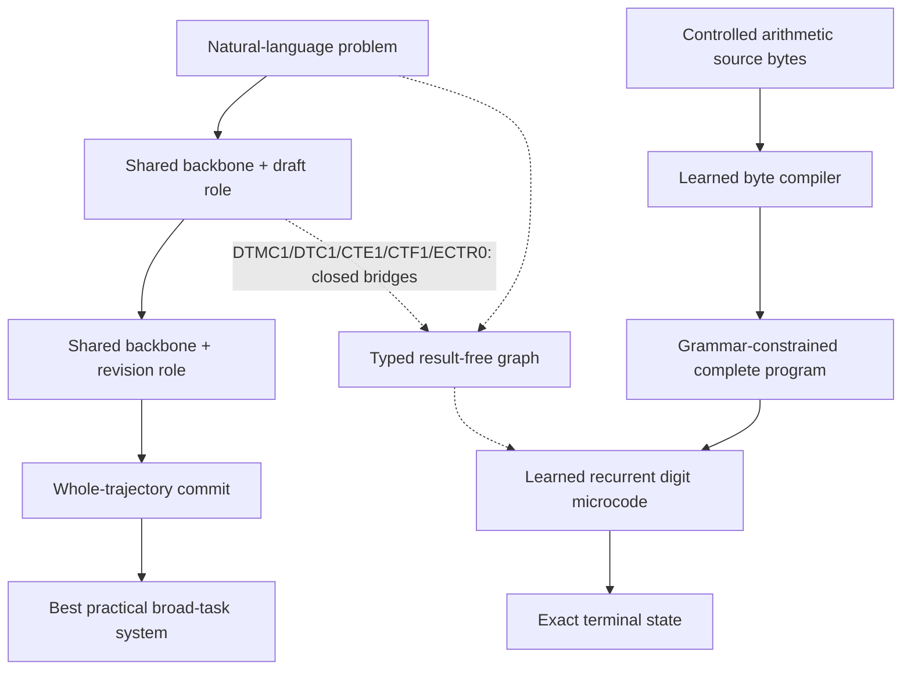
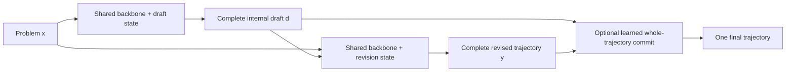

# Shohin: Model-Owned Temporal Revision

> Current architecture and evidence boundary — 2026-08-11

## Read this first

**PCF2 is now prospectively authorized and frozen.** PCF1 remains closed with
formal result `null`; its CPU-only first job failed before model, data, H100,
or assessor work because Newton did not set `SLURM_TMPDIR`. After preserving
that evidence, the user explicitly authorized one separately named successor.
PCF2 changes only allocation-local scratch orchestration and keeps the exact
PCF1 host, data, arms, prompts, seeds, thresholds, sealed board, and stop rule.
It requires independent CPU and H100 scratch canaries before the one scientific
graph. See
`docs/research/SHOHIN_PCF2_MINISTRAL_PUBLICATION_CONFIRMATION.md`.
Those canaries now pass: CPU `751649` on `evc21` and H100 `751650` on
`evc23`, both `COMPLETED 0:0` with zero restarts; exact-node postchecks
`751652--751653` found both private scratch paths absent. The immutable
qualification is
`docs/research/SHOHIN_PCF2_SCRATCH_QUALIFICATION_20260811.json`.

PCF2 was submitted once as `pcf2_ministral_a439f05_r1`. Its CPU preparation
job `751656` stopped after 160 seconds because an exact nonsealed MBPP
reference contained constructs forbidden to untrusted generated candidates.
This occurred before atomic source publication, any H100/model/training/
generation work, or any assessor open. Jobs `751657--751684` never started
and were cancelled; all record zero restarts. Formal PCF2 result is `null`.
The exact terminal receipt is
`docs/research/SHOHIN_PCF2_TERMINAL_INFRASTRUCTURE_RECEIPT_20260811.json`.

**PCF3 is now prospectively frozen.** It changes only the admission treatment
of exact supervisor reference solutions: they execute as trusted references
inside the same sealed Bubblewrap boundary, while generated candidates retain
the unchanged restrictive policy SHA-256 `f27124db...f1e`. A full nonsealed
reference canary and fresh sandbox receipt must pass before its sole graph.
See `docs/research/SHOHIN_PCF3_MINISTRAL_PUBLICATION_CONFIRMATION.md`.

PCF3 closed before admission: CPU canary `751693` rejected the historical
hash-pinned source path lexically before opening it. Formal result is `null`;
see `SHOHIN_PCF3_TERMINAL_INFRASTRUCTURE_RECEIPT_20260811.json`. **PCF4 is
prospectively frozen** with one change: the canary receives the same exact
full-hash source-path exception already used by preparation. All science and
generated-candidate security remain unchanged. See
`SHOHIN_PCF4_MINISTRAL_PUBLICATION_CONFIRMATION.md`.

PCF4 also closed before scientific admission. CPU canary `751696` passed its
fresh 40-probe sandbox qualification, then stopped before any reference
execution because standalone setup qualification evaluated a frozen setup
that depends on the candidate-defined `Node` class. No graph, H100, model,
published data, assessor, or scientific score was reached; formal result is
`null`. Preserve
`SHOHIN_PCF4_TERMINAL_INFRASTRUCTURE_RECEIPT_20260811.json`. **PCF5 is now
prospectively frozen** with one infrastructure-only repair: trusted setup and
official-test sources are compiled before the candidate, but setup evaluation
occurs only in its correct post-candidate context. Generated-candidate policy
and all scientific clauses remain unchanged. Follow
`SHOHIN_PCF5_MINISTRAL_PUBLICATION_CONFIRMATION.md`.

PCF5's required infrastructure-only reference gate is now PASS. CPU job
`751699` completed on `evc21` in 32 seconds with zero restarts: all `167/167`
nonsealed frozen references passed, both unique setups compiled, all 40
sandbox probes passed, and holdout-reference payload access was zero. Exact
node postcheck `751701` proved `/tmp/pcf1-751699-scalar` absent. Bind final
admission to `SHOHIN_PCF5_REFERENCE_QUALIFICATION_20260811.json`; no
scientific graph had been submitted when this evidence was sealed.

PCF5 subsequently closed before mechanics. Preparation job `751745` passed;
H100 mechanics job `751746` then stopped after one second because Slurm's
automatic `SLURM_EXPORT_ENV` metadata duplicated the export string containing
the pinned historical Python path. It failed before model verification,
staging, CUDA, or load. All 27 descendants were cancelled and the prepared
assessor has zero semantic reads. Formal result is `null`; preserve
`SHOHIN_PCF5_TERMINAL_INFRASTRUCTURE_RECEIPT_20260811.json`. **PCF6 is now
prospectively frozen** with only duplicate Slurm export-metadata removal before
the unchanged actual-variable firewall. It requires a no-model H100 environment
canary before its one graph; follow
`SHOHIN_PCF6_MINISTRAL_PUBLICATION_CONFIRMATION.md`.

The sole authorized publication experiment was **PCF1**, one prospective,
source-disjoint confirmation of the surviving dense architecture on pinned
`mistralai/Ministral-3-8B-Reasoning-2512@81eaece...d894`. The qualified
positive anchor remains Qwen3.5-9B at learned commit `383/538`, trained
revision `374/538`, and unchanged `316/538`. PCF1 freezes the same mechanism:
model-owned source-only draft, trained same-family revision, and learned
whole-trajectory commit, with matched unchanged and self-refinement controls.
Its 1,289-row confirmation is label-free on GPU and may be assessed exactly
once by one authorized CPU process. Any missed conjunct is terminal; a pass
also stops and does not automatically open holdout, product, public, another
host, or a successor. See
`docs/research/SHOHIN_PCF1_MINISTRAL_PUBLICATION_CONFIRMATION.md`.

The single frozen graph was submitted exactly once as
`pcf1_ministral_8264817_r1`, from commit
`8264817827d29795d107ff132e85950eb0c34163` with runtime-manifest SHA-256
`f6d5ebe59d7d889f8d804cec05ba8c1895f7ae1c180997a5069075ffb65f67cd`.
Root job `750976` was `FAILED 2:0` on `evc21` after one second with
`pcf1: SLURM_TMPDIR is required for offline caches`. No model or H100 work,
scientific gate, score, or protected-data open occurred. All 28 downstream
jobs `750977--751004` were explicitly cancelled; the queue is empty and every
job records zero restarts. Formal PCF1 result is `null`. The remote terminal
receipt SHA-256 is
`366ebd73e13d1f944b1a233bf86c87440a23295ecdc4caa4b045462a8d3dbef0`.
This is the contract's terminal infrastructure outcome: it is not a wrong
answer and cannot be replayed or retried; no successor is authorized.

The storage and sandbox gates remain PASS. Three settled Newton observations
report `838,918,136 KiB / 768,478` in use, leaving
`220,143,624 KiB / 241,522` of hard-limit headroom. The exact age-ordered
ledger is `docs/research/SHOHIN_PCF1_STORAGE_RECLAMATION_20260811.md`; its
authorized closed-lane deletions were permanent and are not locally
recoverable, while all protected PCF1 and qualified-release anchors survived
an independent read-only postcheck.

The Newton code sandbox is independently qualified. Exact source SHA-256 is
`7b1eb83fb5546fd3c782cccef9a3254b90657b36cc90c023184136a6ed196523`;
qualification receipt SHA-256 is
`f1423aaed0d4b764f81f48a0289d4122b755955f9d961db50b45f485130df070`,
with all `40/40` adversarial probes true. Config, candidate-policy, and Python
descriptor SHA-256 values are respectively
`4e3aaf268e3d16ba900b467c543ac074c9c738f5dee05d0d8b22f0366ae99a33`,
`f27124db3d134a1e3dbde06958ab03220cd5e9585abcc356baa6a49d9edd1f1e`,
and `025190cde6346cdbebfc04a06650f4813e2e8ead5350eec55c0b460caabb362f`.
Earlier fail-closed Newton admissions exposed a libc pin, the missing Python
memfd ABI, a UTF-8 descriptor mismatch, a direct-PID-1 CPU-limit exit `137`,
and then root-writability/safe-import probe failures. They are preserved as
infrastructure evidence: none emitted a qualification receipt or ran a model,
scientific score, or H100 job.

The sole falsifiable scientific gate remains unchanged but was never reached:
unchanged must reach at least
`387/1289` with every domain nonzero; revision must beat unchanged by at least
65 and self-refinement by at least 39 with no domain loss against either;
commit must beat revision by at least 13, retain at least 95% of both the
revision-correct and unchanged-correct sets, and lose no domain against
revision; and custody must cover the exact `1289/1289` order with zero
candidate-assessment truncation, zero malformed selections, complete hashes
and accounting, and zero holdout/public/product access. No formal PASS or FAIL
was produced; the recorded result is `null`. The frozen contract nevertheless
makes this infrastructure failure terminal and authorizes no replay, retry,
successor, or protected split. NDR1, KCR1, VTE1, the natural-language
microcode bridge, the Q35 edit cascade, and small-OLMoE variants remain
closed.

Shohin is now a **transferable reasoning architecture for pretrained language
models**, not primarily a plan to train another small decoder from scratch.
Its strongest demonstrated mechanism is **model-owned temporal revision**:

1. one role state of a pretrained model writes a complete solution draft;
2. a separately trained role state of the same model reads the original
   problem and that exact draft;
3. it emits one coherent replacement trajectory; and
4. an optional learned commit policy chooses one complete trajectory without
   mixing answer fields.

At inference there is no external proposal model, verifier, correctness bit,
benchmark router, symbolic solver, retrieval system, or teacher. The draft is
an internal computational artifact produced and consumed by the deployed
model family.

The architecture has produced large, source-disjoint gains on dense Qwen
models from 0.8B through 9B and a strong aggregate gain on dense SmolLM3-3B.
It has **not yet transferred strongly to a sparse Mixture-of-Experts (MoE)
host**. Small-OLMoE experiments show that late shared-attention adaptation,
static router-logit residuals, and shared post-MoE residuals weakly modulated
by native expert codes all provide at most modest gains. Giving each native
expert its own residual transform or routing among a new revision-only expert
bank performs worse than shared correction. The best current OLMoE arm is an
all-layer shared rank-18 post-MoE residual at `248/1,289`, versus unchanged
`191`; a token-causal persistent-state router reaches only `249`, with expert
top-1 routes changing on `0.0248%` of traced token/layer events. These are
useful modest effects but remain below the frozen capability threshold. The
small-OLMoE native-transfer lane is closed; larger-MoE scaling is not
authorized from this evidence.

A later Qwen3.6-35B-A3B program made draft editing explicitly causal with
model-emitted KEEP/REPLACE transactions and deterministic execution. It
qualified script mechanics but did not produce a reliable general semantic
commit policy. The final frozen composition started from the strongest
model-owned proposals (`1838/1908`), then the aligned trained editor reduced
them to `1835`; swapped and draft-hidden controls preserved `1838`. This
closes that explicit edit cascade without holdout or nearby retries. It does
not displace the qualified dense draft/revision/whole-trajectory architecture
described below.

Shohin also now has a separate **learned-microcode architecture lane**. Its
qualified development composition is:

```text
raw source bytes
    -> learned 4.94M byte compiler
    -> width-64 grammar-constrained program search
    -> learned 108K-logit recurrent digit microcode
    -> exact terminal state
```

LAM1 executes learned local add/subtract/multiply digit transitions
recurrently instead of asking a language model to regenerate complete
arithmetic values. The frozen composition is exact on `3,917/3,917`
source-disjoint development rows, with source shuffle `7/3,917`, source
removal `14/3,917`, carry reset `367/3,917`, opcode permutation `5/3,917`,
and zero normal invalid or exhausted executions. This is the strongest
complete controlled source-to-terminal Shohin result. It remains a
development result with explicit grammar, stack, and rational-state
scaffolding; WGP1's confirmation source failed admission before model scoring,
so no LAM1 holdout claim exists.

The latest learned natural-language successor was **DTMC1**. A question-only typed
compiler (TMC1) was causal but solved only `44/666 = 6.61%`, showing that one
static source representation did not expose a sufficient semantic plan.
DTMC1 therefore reads the frozen model's own autoregressive draft and emits a
result-free typed computation graph whose numeric pointers remain restricted
to the original problem. Its frozen corpus contains all `6,333` training
identities, including `1,904` exhausted drafts; every source-plus-draft input
passes the 1,024-token custody audit with zero truncation or pointer leakage.
The 24.86M-parameter fit closed negative: aligned source-plus-draft reaches
`45/666 = 6.76%`, versus draft shuffle `5/666`, source-plus-draft shuffle
`4/666`, question-only TMC1 `44/666`, and direct generation `267/666`.
Operation/operand accuracy is only `47.61% / 32.40%`. The draft is causally
used, but this full-graph fixed-slot interface does not improve capability and
is not part of the release architecture. Public test remained sealed.

A final read-only bridge diagnostic, **DTC1**, then bypassed learned graph
decoding entirely. It lowered explicit `<<expression=result>>` transactions
from the same owner drafts into causal typed state references and let frozen
LAM1 recompute every value. The mechanism is sharp when a trace exists:
aligned scores `108/666`, draft shuffle and source-plus-draft shuffle each
score `1/666`, state reset retains only `1/98` linked aligned solves, opcode
permutation retains four, and normal execution has zero invalid rows. But
only `257/666` owner drafts expose any accepted transaction. DTC1 repairs seven
direct errors while breaking fourteen and remains far below the direct owner
at `267/666`. This closes parser-level recovery: the current 0.8B owner often
does not externalize a usable program at all.

Canonical transaction post-training did not solve that planning boundary.
CTE1 produced 598 executable ledgers but only `134/666` exact answers, versus
the direct 0.8B owner at `267/666`; accuracy falls from `35.85%` at depth two
to zero at depths six through eight. The ledger and executor are causal—state
reset retains `1/131` linked solves and opcode permutation `1/666`—but they
faithfully execute semantically wrong plans. A CPU-only locality audit then
closed ledger editing before training: wrong ledgers have only 9.98% mean and
0% median gold-record copy, with just 26.88% within two record edits.

The strongest capability-floor diagnostic uses untouched Qwen3.5-4B through
the same canonical parser and learned LAM1 executor. It reaches `419/666`,
with source shuffle `7`, state reset `0/419`, opcode permutation `3`, and zero
normal execution invalidity. This shows that model scale restores substantial
semantic program generation. It still fails the architecture gate: only
`562/666` traces compile, and the capable 4B owner's direct answer claim is
`487/666`. Exact ledger execution contributes 11 ledger-only solves but loses
79 direct-only solves. Therefore the current natural-language microcode bridge
is closed: learned execution is causal, but it does not improve the capable
owner.

Executor-conditioned temporal revision does not rescue that bridge. With the
qualified IDR4 4B reviser frozen, ECTR0 scores `476/666` when given the aligned
canonical trace and learned-executor receipt, versus `479` with no receipt,
`468` with a matched shuffled receipt, and the direct owner's `487`. Aligned
repairs 15 direct errors but breaks 26. The receipt perturbs revision, but it
does not add useful capability; exact ECTR0 is closed without training or
public-test access.

Paired read-only attribution sharpens that boundary. Direct and learned-
executor answers differ on 137 rows; the aligned reviser follows direct on
109, follows the executor on only one, and emits a third answer on 27. The
direct/executor oracle is only `498/666`. Better receipt phrasing or a hard
selector therefore cannot provide a large bridge; the open capability path is
broad model-owned temporal-revision training, not another microcode-interface
retry.

Broad natural-draft revision has now also received a clean negative test.
NDR1 generated one Qwen3.5-9B+B1 draft for each of 11,220 fresh verified,
evaluation-disjoint sources and trained matched aligned and same-domain
nearest-length shuffled revision arms. On the frozen 1,289-row development
board, aligned scored `306`, shuffled `343`, and unchanged `340`; aligned
exhausted its 768-token budget on 879 rows versus 768 for shuffled. The exact
model-owned draft therefore reduced capability and completion efficiency under
ordinary full-trajectory CE. NDR1 closes without a nearby retry, and holdout
remains sealed. This result reinforces the architectural requirement that a
future reviser must make draft-dependent state or execution causally necessary
rather than simply append a draft to source-to-solution training.

The final bounded transaction family is closed. KCR1's unique canonical
KEEP/CONTINUE/RESTART labels reached `1294/1566` semantic correctness despite
only `1144/1566` canonical actions, exposing label nonidentifiability. VTE1
then trained over complete independently verified transaction-equivalence
sets. It scored `1285/1566`, nine answers below KCR1, while emitting RESTART
on every row, preserving zero KEEP drafts, and exhausting 197 generations.
Set-valued supervision removed the arbitrary-label penalty but induced
universal regeneration. KCR1 and VTE1 are closed without nearby retries;
their controls, broad development, and holdout remain unopened.

Historical ETTR graph-reactor and synthetic compiled-state experiments remain
valuable research history, but they are not the current deployable Shohin
architecture. The complete historical ledger is
`SHOHIN_NATIVE_REASONING_MASTER.md`.

## Current architecture map

Shohin currently contains two evidence-backed architectural paths and one
open bridge between them:



The solid upper path is the qualified deployable temporal-revision system.
The solid lower path is the qualified controlled LAM1 development system. The
dotted bridge represents the closed DTMC1/DTC1/CTE1/CTF1/ECTR0 negatives: they
demonstrate causal draft signal, causal transaction execution, and improved
program quality with scale, but not a natural-language-to-microcode path that
beats the capable direct owner.

## The architecture

Let `G(theta, x, b)` denote bounded generation by a pretrained model with
parameters `theta`, prompt `x`, and generation budget `b`. Shohin installs two
small role states on a shared pretrained backbone:

```text
draft d    = G(theta + delta_draft, source, budget)
revision y = G(theta + delta_revision, source || exact_draft(d), budget)
final      = whole_trajectory_commit(d, y)
```

`delta_draft` and `delta_revision` are role-specific low-rank states rather
than independent full models. During revision training, the backbone and
draft owner are frozen. The revision state is trained on complete verified
target trajectories, not merely final answer labels. Deployment therefore
contains one backbone, two small role states, and a deterministic two-phase
controller.



### What is structurally different

A normal decoder makes one left-to-right commitment. Ordinary self-refinement
asks the unchanged model to try again. Best-of-two spends more inference
compute but does not learn how to use its own earlier trajectory. Shohin
instead trains a **role-specific later state** on the causal object created by
the earlier state.

The changed factor is not simply “more tokens” or “another LoRA”:

- the first pass externalizes a full tentative computation;
- the second role is trained specifically to diagnose and replace that
  computation;
- source and exact draft are jointly visible to the reviser;
- the revision is one coherent trajectory, never a fieldwise average;
- matched controls use the same host, draft, prompt, target-token budget, and
  evaluator; and
- source-disjoint identities and sealed holdouts separate training from
  evaluation.

The working interpretation is that the draft becomes a temporary writable
workspace. It exposes intermediate commitments that a later model state can
condition on, revisit, and correct. Evidence supports this interpretation at
the behavioral level: trained revision repeatedly beats an unchanged second
pass, generic self-refinement, longer generation, and draft-masked training.
It does not yet prove a unique internal algorithm or universal reliability.

The revision operator is deliberately one-shot in the qualified release. A
development-only test that applied the same 9B reviser twice fell from
`589/1,289` to `539/1,289`: 15 errors were repaired, but 65 correct answers were
broken. Recursive inference depth therefore requires a separately trained
later owner plus an earned retention mechanism; blindly repeating the current
reviser is closed.

### Whole-trajectory commitment

At 9B, a learned model-owned commit stage compares two complete same-family
trajectories and selects one. The useful result is the learned commit policy,
not the specific antisymmetric scoring form: an antisymmetric relational head
beat a matched independent scorer by only one answer, below the frozen causal
margin. Shohin therefore claims coherent learned commitment, not a distinct
antisymmetry discovery.

## Measured dense-model evidence

All rows below compare trained revision against the matched unchanged second
pass over source-disjoint identities unless noted otherwise.

| Dense host | Development | Holdout | Qualified boundary |
|---|---:|---:|---|
| Qwen3.5-0.8B | `323/1289` vs `236/1289` (`+6.75 pp`) | `328/1279` vs `242/1279` (`+6.72 pp`) | aggregate gain; code `8` vs `9` fails strict retention |
| Qwen3.5-4B | `529/1289` vs `371/1289` (`+12.26 pp`) | `554/1279` vs `380/1279` (`+13.61 pp`) | every attribution domain positive |
| Qwen3.5-9B | `589/1289` vs `464/1289` (`+9.70 pp`) | `625/1279` vs `495/1279` (`+10.16 pp`) | every attribution domain positive; original MATH promotion floor missed |
| SmolLM3-3B | `469/1289` vs `358/1289` (`+8.61 pp`) | sealed | cross-family aggregate gain; executable code `4` vs `9` fails retention |
| OLMo2-7B | `259/1289` vs `231/1289` (`+2.17 pp`) | sealed | positive but too weak to promote |

The 4B protected seven-task product board further tests whether a strong
source-disjoint gain is uniformly reliable. The trained reviser scores
`320/538` versus `272/538`, with macro accuracy `61.39%` versus `51.05%`.
However, GSM8K, MATH-500, and logic regress by two, one, and two answers while
science and code improve strongly. The aggregate result is substantial, but
the predeclared all-domain-nonregression gate correctly fails.

The strongest 9B product system adds a model-owned whole-trajectory commit:

| 9B product system | Solved | Five-domain macro |
|---|---:|---:|
| unchanged second pass | `316/538` | `67.263%` |
| trained revision | `374/538` | `75.005%` |
| learned whole-trajectory commit | `383/538` | `75.815%` |
| coherent oracle ceiling | `399/538` | `78.619%` |

This is the strongest practical Shohin result. It establishes useful
same-family draft/revision/commit computation on a dense 9B host. It is not a
claim that the original 125M scratch checkpoint is a frontier reasoner.

The complete system is now packaged as an immutable delta and has passed a
five-prompt end-to-end H100 smoke test. The package verifies the pinned base,
draft adapter, trained revision adapter, learned commit state, reports, and
product qualification before inference, then records all candidates and the
selected whole trajectory. See
[`docs/research/SHOHIN_IDR_AQC_DEPLOYABLE_RELEASE.md`](docs/research/SHOHIN_IDR_AQC_DEPLOYABLE_RELEASE.md).

## What did not work on dense hosts

Several negative results constrain the design:

- A generated KEEP/REVISE selector on OLMo2-7B scored `229/1289`, below both
  unchanged (`231`) and always-revise (`259`). Read-only attribution showed
  that a perfect selector could add only one answer beyond always-revise.
  Selection was not the bottleneck.
- An eight-step recurrent error-syndrome workspace scored `255/1289` versus
  `239` for its identical workspace control, demonstrating a small causal
  effect, but it remained below direct revision at `259` and regressed math
  and code. A latent correction-direction objective was not sufficient.

These failures point toward revision capacity and capability preservation,
not a larger output selector.

## The current MoE failure boundary

The first MoE host is pinned
`allenai/OLMoE-1B-7B-0125-Instruct`: 7B total parameters, approximately 1B
active parameters, 64 experts, eight selected per token, 16 decoder layers.
The exact same source-disjoint temporal-revision geometry was used.

### MTR1: shared-attention revision

MTR1 trained rank-8 LoRA only in shared attention projections of the final
four layers. Router and expert parameters remained frozen. It used 524,288
trainable parameters.

| Arm | Correct / 1289 | Accuracy |
|---|---:|---:|
| shared-attention temporal revision | `204` | `15.8262%` |
| unchanged second pass | `191` | `14.8177%` |
| generic self-refinement | `169` | `13.111%` |
| long single generation | `167` | `12.956%` |
| best-of-two | `134` | `10.396%` |
| draft-masked independent training | `189` | `14.6625%` |

The treatment improves every broad domain nonnegatively (`+1` math, `+12`
logic/science, `0` code), but gains only 13 answers / 1.01 points—far below
the frozen `+5 pp` and strongest-control `+3 pp` gates.

Router accounting is especially informative. Across 87 rows and 74,935
tokens, every expert is used and normalized route entropy remains about
`0.932`, yet trained-versus-base route-count L1 drift is zero in layers 0–11
and only `0.00184`, `0.00381`, `0.00709`, and `0.01955` in layers 12–15.
Mean all-layer drift is `0.002018`. The adapter changes some answers while
leaving sparse computation almost unchanged.

### RCR1: direct router-logit residual

RCR1 then trained a bounded rank-8 residual directly on the final four router
logits while freezing every base router and expert. It used 67,584 trainable
parameters and was compared with a 65,536-parameter rank-1 shared-attention
control under the same data and 256-update budget.

| Arm | Correct / 1289 | Accuracy |
|---|---:|---:|
| revision-conditioned router residual | `194` | `15.0504%` |
| matched rank-1 attention | `191` | `14.8177%` |
| unchanged second pass | `191` | `14.8177%` |
| prior rank-8 shared-attention MTR1 | `204` | `15.8262%` |

RCR1 adds only three answers and remains below MTR1. Exact RCR1 is closed.
The larger Qwen3.6-35B-A3B MoE campaign is not authorized merely because its
one-H100 NF4 mechanics fit; scaling a failed intervention would not identify
the missing mechanism.

## What the MoE result means

The evidence rules out two narrow hypotheses:

1. late shared-attention adaptation alone is enough to transfer dense
   temporal revision to this small MoE; and
2. a small, token-local, static residual on late router logits is enough.

It does **not** show that temporal revision is incompatible with MoE. Several
mechanisms remain unresolved:

- **Routing may already be adequate while experts lack revision-specific
  computation.** Redirecting a token among frozen experts cannot create a
  correction operation that none of those experts learned.
- **The controller may need memory across tokens.** Revision is a trajectory-
  level process, while RCR1 perturbs each router from the current hidden state
  independently. It has no persistent draft-diagnosis state.
- **The intervention may occur too late.** Restricting adaptation to four late
  layers cannot change expert selection or representation formation in the
  first twelve layers.
- **Top-k routing is discontinuous.** Small logit changes often leave the same
  eight experts selected; larger changes may destabilize load without
  producing useful specialization.
- **The small host may be capacity-limited.** Approximately 1B active
  parameters may be too weak to exploit the draft reliably even though 7B
  parameters exist in total.
- **Output loss weakly supervises routes.** A sequence-level correction target
  supplies a long credit-assignment path to thousands of discrete expert
  choices.

The current task is to distinguish these causes from existing completed
artifacts before training another mechanism. Outcomes are being partitioned
into corrected, broken, persistent-wrong, and preserved-correct cases and
correlated with per-layer route changes, expert overlap, entropy, and load.

## The leading MoE-native successor

The strongest current direction is a **draft-conditioned multi-token revision
controller**, contingent on the attribution above. It would summarize the
source/draft discrepancy into a persistent recurrent state and use that state
through multiple layers and output tokens to control both:

1. bounded router-logit deltas; and
2. small revision-specific expert-side low-rank adapters or a shared adapter
   basis whose coefficients are selected by the controller.

Conceptually:

```text
s_t = recurrent_controller(s_(t-1), source_state, draft_state, h_t)
router_logits' = router_logits + bounded_route_delta(s_t, h_t, layer)
expert_output' = expert_output + selected_low_rank_delta(s_t, h_t, expert, layer)
```

This is not yet a result or a frozen final design. Its purpose is to test the
missing interaction that MTR1 and RCR1 exclude: persistent trajectory-level
diagnosis plus revision-specific computation inside the sparse path.

A valid experiment must include matched controls:

- equal-budget dense shared-attention adaptation;
- router-only recurrent control;
- expert-adapter-only control;
- shuffled-draft or draft-masked controller;
- identical update/data/decoding budgets; and
- router utilization, entropy, expert overlap, active parameters, FLOPs,
  memory, latency, and accuracy-per-compute reporting.

The initial gate remains OLMoE development. Only a preregistered pass on both
overall margins and all-domain retention may open its sealed holdout and then
authorize a larger MoE host.

## Honest claim boundary

Shohin currently supports these claims:

- trained same-family draft-conditioned revision produces large aggregate
  gains on several dense pretrained models;
- the effect survives a 0.8B-to-9B Qwen scale intervention and transfers in
  aggregate to SmolLM3;
- a learned whole-trajectory commit improves the strongest 9B product system;
- capability preservation is not universal; and
- two plausible small-MoE interventions have failed under matched controls.

Shohin does not yet support these claims:

- reliable improvement in every domain or model family;
- successful temporal revision on MoE;
- open-domain frontier reasoning;
- a novel antisymmetric selector mechanism;
- a reasoning result from the old 125M Shohin checkpoint; or
- authorization for large-scale MoE training before the mechanism passes on
  the small host.

## Where to read next

- `docs/research/SHOHIN_MOE_FRONTIER_CONSULTATION_BRIEF_20260809.md` —
  self-contained MoE problem statement and design request.
- `docs/research/SHOHIN_TRANSFERABLE_TEMPORAL_REVISION_CONTRACT.md` — exact
  architecture and matched-control contract.
- `docs/research/SHOHIN_MTR1_SMALL_MOE_TRANSFER.md` — shared-attention MoE
  experiment.
- `docs/research/SHOHIN_RCR1_REVISION_CONDITIONED_ROUTING.md` — direct router
  experiment.
- `docs/research/DIVERGE_IDR1_INTERNAL_DRAFT_REVISION.md` and
  `docs/research/DIVERGE_AQC1_ANTISYMMETRIC_QUOTIENT_COMMIT.md` — strongest 9B
  revision and commitment evidence.
- `SHOHIN_NATIVE_REASONING_MASTER.md` — complete chronological ledger,
  including negative and historical work.
