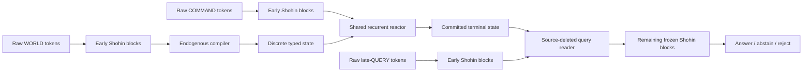

# Shohin-ETTR: Compiled-State Reasoning

> **ETTR** means **Endogenous Typed Theory Reactor**. It is Shohin's
> implementation of **compiled-state reasoning**: compile language into a
> finite typed state, transform that state with a learned generic machine, and
> answer only from the terminal state.

## Read this first: current status

ETTR's trainable architecture, causal continuation contract, source-deleted
runtime, cross-ontology qualification board, and one-H100 architecture profile
are implemented. The architecture has passed its local mechanics, custody, and
resource gates. It has **not** been trained to demonstrate learned transfer or
general reasoning; continuation pretraining remains explicitly held.

That distinction is deliberate: Shohin has implemented an architectural
candidate for model-native reasoning, not yet proven that the candidate learns
the intended capability.

## What Shohin is now

Shohin is a **192.8M-parameter language model with an explicit, trainable
reasoning workspace**.  It retains a 125.1M-parameter causal transformer as
its language substrate, then adds a 67.7M-parameter **Endogenous Typed Theory
Reactor (ETTR)**.  ETTR forces the model to translate a described world into a
bounded, discrete typed graph; manipulate that graph through a small set of
generic transactions; and answer a later question using only the resulting
graph state.

The central architectural move is to make the model's intermediate world
state an actual, inspectable computational object rather than an implicit
pattern distributed across token activations. The model must learn the
compiler, controller, and reader itself. There is no task-specific parser,
rule engine, search procedure, arithmetic routine, rewrite matcher, resource
scheduler, answer callback, or semantic host code in the candidate runtime.



The three streams are causally separated: the world is compiled before the
command phase; the world source is not available after compilation; and the
late query cannot access world tokens, compiler residuals, KV cache, parser
state, or the execution trajectory. The declared typed state is the only
cross-stage object.

## The architectural thesis

An ordinary transformer can represent a world, an algorithm, and an answer in
the same residual stream, with no requirement that they remain separate. It
can answer from surface-text shortcuts, reuse source tokens at query time, or
store answer-bearing information in opaque activations. ETTR imposes a
different computation:

```text
raw language -> anonymous typed state -> learned state transitions -> late answer
```

The middle object is both **hard** and **sufficient**. It is hard because the
deployed packet admits only finite categorical and binary fields. It is
sufficient because the late reader receives no other world-derived
information. If a trained model eventually succeeds under ETTR's causal
controls, it must have learned to compile and use the state rather than merely
continue the original text.

## The base language model

The underlying Shohin checkpoint is a compact, deep-and-thin decoder-only
transformer:

| Property | Design |
|---|---|
| Base parameters | 125,081,664 |
| Width / depth | 576 hidden width, 30 transformer blocks |
| Attention | 9 query heads and 3 KV heads (grouped-query attention) |
| Context / vocabulary | 2,048 tokens / 32,768 tokens |
| Core blocks | causal attention, RoPE, RMSNorm, SwiGLU, QK normalization |
| Embeddings | input/output embeddings tied |

ETTR taps the residual stream after block 20.  The remaining transformer
blocks remain the normal language decoder after the state-aware query reader
has injected its result.  This lets Shohin keep ordinary language modeling
while adding a distinct stateful computation path.

## The ETTR mechanism

### 1. Raw-token world compiler

The compiler cross-attends 64 learned anonymous object slots to the protected
Shohin residuals for the WORLD text.  It emits a bounded typed graph, not a
continuous hidden-state cache:

- 64 object, relation, and value-node slots;
- one of 256 categorical value codes per active slot;
- one of 8 latent types per active slot;
- 16 directed relation roles;
- an edge ledger capped at 256 edges;
- activity and root indicators; and
- two terminal-status bits.

Ordered hyperedges and multi-byte values are represented by explicit reified
nodes, rather than silently encoding order or content inside a scalar edge
label.  At deployment, the packet rejects continuous value channels,
non-one-hot codes/types, non-binary control values, and over-capacity relation
ledgers.  This makes the handoff a finite state object with an auditable
schema, not a lossy text summary.

The compiler is **endogenous**: no external semantic parser constructs this
packet. Slots are not preassigned to names, predicates, theories, or ontology
families. The learned compiler must bind linguistic evidence to episode-local
objects, roles, and values.

### 2. Generic transaction reactor

After the world is sealed, a six-layer recurrent controller reads the typed
state and a separate COMMAND stream.  It can issue only nine structural
actions:

```text
ALLOC  WRITE  CLEAR  LINK  UNLINK  SET_ROOT  COMMIT  HALT  REJECT
```

Those are intentionally *not* domain operations.  For example, the runtime
does not contain a Horn-clause opcode, a rewrite rule matcher, or a
resource-transition primitive.  Every operation only allocates/edits graph
cells, adds/removes typed directed edges, selects a root, or terminates.
Consequently, any theory-specific behavior must be encoded in the learned
compiler and recurrent controller, rather than delegated to a fixed executor.

The reactor uses a shared six-layer transformer controller, a learned control
seed, a learned step embedding, and cross-attention to the post-seal COMMAND
representation. It predicts an opcode, source slot, target slot, relation,
type, and value code at every recurrent step. The identical controller is
intended to operate across all theory families; it is not routed to
family-specific heads.

At every step the reactor reconstructs slot features from categorical
value/type embeddings, activity, root, and terminal status.  Its relation
message bus is **endpoint-aware**: it aggregates separate incoming and
outgoing messages for every relation role.  This preserves *which* neighbor
is connected to which slot, solving the failure mode of degree-only graph
summaries that cannot distinguish different graphs with the same per-node
relation counts.

The controller has a 64-step bound.  `COMMIT`, `HALT`, and `REJECT` create four
explicit, always-visible dispositions:

| Status | Meaning |
|---|---|
| `OPEN` | execution may continue |
| `ANSWER` | committed answer state |
| `ABSTAIN` | halted without commitment |
| `REJECT` | committed contradictory/invalid state |

Once terminal, later structural updates are frozen.

The reactor's graph access is deliberately stronger than relation-count
summaries. For every slot and every relation role it forms distinct incoming
and outgoing messages from the actual neighboring slot features. A
degree-preserving edge swap therefore changes the available evidence and is
detected by both the reactor and the late query reader. This prevents a graph
with the right counts but wrong endpoints from looking identical to the model.

### 3. Exact discrete execution with usable gradients

ETTR uses hard one-hot choices and capped binary edges in the forward pass.
The deployed state is therefore exact and discrete, while the corresponding
pre-discretization probability distributions remain on the backward path via
a straight-through estimator.  This is a deliberate hybrid:

- inference can be audited as a concrete sequence of graph transactions;
- training can still correct the compiler and controller with gradients; and
- the model cannot hide answer-bearing continuous vectors in the cross-stage
  packet.

### 4. Source-deleted late-query reader

The query reader receives only the terminal typed state and the raw QUERY
tokens.  It cannot revisit the WORLD text or reuse compiler activations.  It
builds state features from all declared fields—values, types, active/root
flags, disposition, and endpoint-aware incoming/outgoing relation messages—
then cross-attends the causal query representation to those features.  Its
state-derived residual is added back to the query stream before Shohin's final
decoder blocks produce language tokens.

This creates an explicit bottleneck: a correct later answer has to be
recoverable from the finite state object, not from an accidental source-text
shortcut.

### 5. Complete execution lifecycle

Every ETTR example is a causal episode, not a single concatenated prompt:

1. **WORLD:** early Shohin blocks encode raw world tokens; the compiler writes
   an initial hard state.
2. **COMMAND:** a separately encoded post-seal command conditions the reactor,
   which applies up to 64 generic transactions.
3. **COMMIT:** terminal state is hard-validated; terminal dispositions freeze
   subsequent edits.
4. **QUERY:** the reader receives terminal state and late query tokens only.
5. **ASSESS:** an independent process evaluates candidate output after all
   candidate stages have exited.

This makes command a real intervention on a compiled world and makes the late
query a real consumer of the result.

## Why this differs from a standard transformer

| Standard decoder-only transformer | Shohin with ETTR |
|---|---|
| Keeps all task state implicitly in contextual activations and KV cache | Compiles an explicit bounded typed graph with discrete deployed fields |
| Interleaves source, instructions, and question in one attention context | Enforces `WORLD -> COMMAND -> QUERY` causal stages and source deletion |
| Produces next tokens directly | Performs a recurrent sequence of inspectable structural transactions before answering |
| Uses learned attention patterns as its only relational substrate | Uses an endpoint-aware, typed directed relation ledger plus message bus |
| Has no architectural representation for uncertainty disposition | Carries explicit `ANSWER`, `ABSTAIN`, and `REJECT` terminal states |
| Can rely on textual coincidences across a prompt | Must pass through a source-free packet whose schema excludes text, offsets, residuals, caches, and answer labels |
| Typically applies soft continuous activations end-to-end | Executes hard categorical/state transitions while retaining corrective gradient paths |

The intended result is not simply “a transformer with more parameters.”  It
is a language-conditioned compiler, state machine, and state-conditioned
reader trained as one differentiable system.

## Training and causal safeguards

ETTR's continuation contract treats each example as three independently
bounded segments: `WORLD`, `COMMAND`, and `QUERY`.  Language-model targets do
not cross segment boundaries.  The objective combines:

- initial-packet and free-running terminal-packet supervision;
- transaction supervision;
- initial and terminal renderer-equivariance;
- commit/halt, sparsity, and hard-state validity constraints;
- anti-bypass objectives that intervene on WORLD and COMMAND factors; and
- matched-prefix query-binding losses, where identical query prefixes require
  different answers when the underlying world or command changes.

The interventions are arranged as semantically distinct 2×2 causal
rectangles with different raw renderings.  This is designed to prevent a
query-only language-model shortcut from satisfying the objective while
ignoring the compiled state.

For eventual training, the protected base and ETTR additions have disjoint
optimizer groups.  Checkpoints bind model, optimizer, schedule, RNG, data
cursor, source manifest, and base-model provenance; they can be admitted only
at a complete optimizer/between-episode boundary.

### Causal anti-bypass objective

Every primary training/evaluation unit is a semantic 2x2 rectangle: two WORLD
factors crossed with two COMMAND factors. Equivalent factors use different raw
renderings. The system supervises initial packets, free-running terminal
packets, and each transaction, but also asks whether the final reader changes
its answer in the *correct direction* when only WORLD or only COMMAND changes.

The frozen qualification scorer contains seven arms:

```text
treatment        query-only        zero-reader        shuffled-state
wrong-WORLD      wrong-COMMAND     query-twin / target-derangement
```

The answer suffix is physically absent before candidate forward execution;
the candidate never receives a target tensor. Readouts bind exact packet,
query, label, factor, and control-permutation bytes into a batch receipt. This
is designed to distinguish actual state use from arbitrary output movement or
a query-only language-model shortcut.

## Process-level state custody

Shohin is designed around four detached stages:

1. **Compiler:** raw world tokens -> immutable typed state.
2. **Executor:** typed state + command stream -> terminal typed state.
3. **Query reader:** terminal typed state + late query -> answer/disposition.
4. **Independent assessor:** candidate output -> evaluation.

The state wire is allowlisted and non-pickle.  It excludes source text,
offsets, source hashes, residual caches, KV caches, parser state, executable
callbacks, and assessor outputs.  The serial custody test deletes each prior
stage's artifacts before the next stage begins.  These controls aim to make a
future reasoning result attributable to the model's learned packet, rather
than to a hidden host-side channel.

### Claim-bearing qualification architecture

The assessment infrastructure is part of ETTR's architecture contract. A
model cannot credibly claim stateful reasoning if host processes can repair,
read, or swap state behind the scenes. The direct frozen board covers typed
Horn closure, typed term rewriting, and guarded resource processes. Each
ontology supplies a genuine 2x2 WORLD-by-COMMAND rectangle, two late-query
semantics, and two paraphrases: 12 terminal packets and 48 query rows.
Independent exact oracles agree on all 12 programs; each WORLD and COMMAND
edge changes the answer, and each terminal packet supports two different
queries.

Complete model identity binds the protected checkpoint, all ETTR weights,
behavioral configuration, module source, every named parameter, and every
named buffer—including non-persistent RoPE buffers. A verifier-held Ed25519
signing path binds the execution chain. Candidate stages cannot access the
signing key, qualification board, assessor output, or another stage's source
package.

For external deployment, the candidate runtime is measured as an immutable
image and launched under a constrained stage supervisor. This adds no neural
parameters and does not claim learned reasoning; it prevents a future score
from being attributed to an unmeasured runtime or a host-side shortcut.

## Size and implementation receipt

| Component | Parameters |
|---|---:|
| Protected Shohin transformer | 125,081,664 |
| Endogenous world compiler | 21,466,377 |
| Recurrent transaction reactor | 29,757,217 |
| Source-deleted query reader | 16,474,177 |
| **Complete system** | **192,779,435** |
| Headroom below 200M | **7,220,565** |

The protected step-300k base checkpoint is hash-verified as
`211d6b2cddf0c2cf8b12cb0b2d73f9c4440d85f6f531018080c8afd35b2f66a6` and
loads with zero missing or unexpected tensors.

## Completed architecture receipts

### H100 systems profile

The exact ETTR source completed a schema-v5 H100 BF16 profile. Both eager and
compiled arms executed the full factorial objective, backward pass, and one
architecture optimizer update from identical initial model and batch receipts.
Every ETTR component had finite nonzero gradients and a nonzero sampled update.
The frozen base had zero gradients and zero update. The protected checkpoint
remained byte-identical, and no pretraining shards or model state were written.

| Profile arm | Throughput | Peak allocated memory |
|---|---:|---:|
| Eager | 5,108.80 encoded tokens/s | 3,750,596,608 bytes |
| Compiled | 8,771.94 encoded tokens/s | 3,143,077,888 bytes |

Compiled ETTR is **1.7170x** eager throughput while using **83.80%** of eager
peak allocation. This is a systems receipt, not a reasoning benchmark.

### Local verification

The architecture, causal episode contract, custody surfaces, synthetic
cross-ontology assessment, hard-state validation, query-prefix causality,
commit freezing, endpoint-swap falsification, and production supervisor
admission are implemented and tested. The signed stage-supervisor smoke
exercises isolated `WORLD -> COMMAND -> QUERY` execution without training the
model or reading pretraining shards.

## Isolated learnability architecture

ETTR's next scientific layer is not another model redesign. It is a frozen
five-seed, three-fold learnability system around the same 67,697,771 ETTR
parameters and immutable 125,081,664-parameter Shohin base.

The v3 materializer builds anonymous typed episodes for Horn closure, typed
term rewriting, and guarded resources through one common packet and
transaction language. It constructs exact 2x2 WORLD-by-COMMAND rectangles,
separate renderers, held-out rules, longer compositions, structural variants,
and completely withheld ontology folds. Corpus selection and materialization
are deterministic, hash-bound, and separated from confirmation data.

Equal-budget treatment and ablation arms preserve trainable parameter counts,
optimizer updates, token schedules, and measured computation. They test
whether gains come from persistent typed state, recurrence, state/query
coupling, and causal binding rather than from the additional 67.7M parameters
alone. The protected base remains read-only in this isolated gate.

This materialization and custody machinery prepares a decisive experiment; it
does not itself constitute a learned result.

## Honest capability boundary

ETTR is a completed trainable architecture and qualification design. It is not
yet a demonstrated reasoning capability. Only user-authorized fitting followed
by the frozen qualification matrix can test whether one learned
compiler/reactor/reader transfers across unseen theories, rules, depths,
renderers, compositions, and task families.

Native general reasoning and post-training claims require further evidence
beyond that gate. Continuation pretraining remains held.

## Source files

- Architecture: `train/endogenous_typed_theory_reactor.py`
- Causal episode runner: `train/ettr_episode.py`
- Objectives and train step: `train/ettr_objectives.py`, `train/ettr_train_step.py`
- Data, optimizer, and checkpoint contracts: `train/ettr_data_contract.py`,
  `train/ettr_optimization.py`, `train/ettr_checkpoint.py`
- Factorial qualification and scorer: `pipeline/ettr_factorial_qualification_board.py`,
  `train/ettr_factorial_qualification.py`, `train/ettr_qualification.py`
- Model assembly and isolated supervisor: `train/ettr_model_assembly.py`,
  `train/ettr_stage_supervisor.py`
- Learnability materialization: `pipeline/ettr_il_v3_materialize.py`,
  `pipeline/materialize_ettr_il_v3_corpus.py`
- Architecture and custody receipt: `R12_ETTR_ARCHITECTURE_AND_CUSTODY_RESULT.md`
- Full project ledger and current operational state: `SHOHIN_NATIVE_REASONING_MASTER.md`, `AGENT_RUNBOOK.md`
