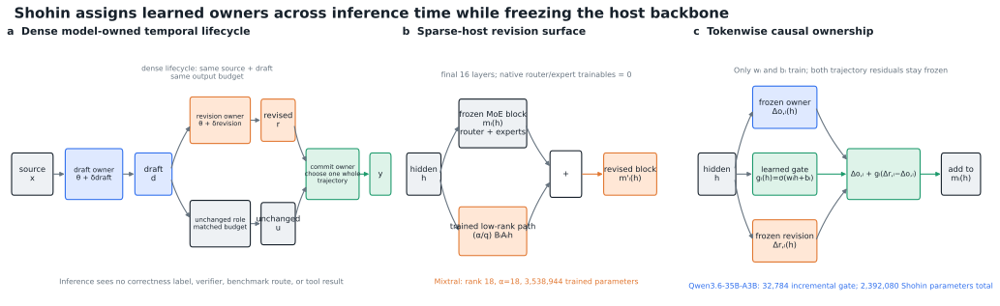
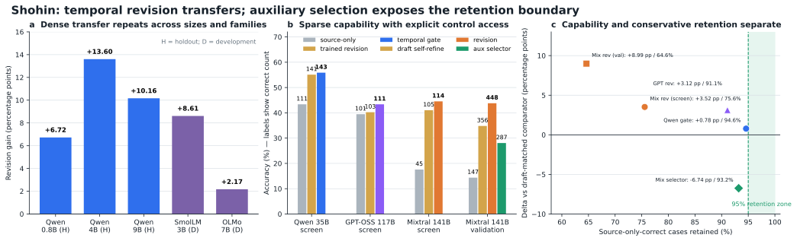

# Shohin: Model-Owned Temporal Revision and Commitment

> Publication evidence report — updated 2026-08-18
> Primary result: protected Qwen3.5-9B product board  
> Evidence boundary: completed dense transfer, a causal 35B MoE screen, and
> matched 141B-total / 39B-active cross-family MoE screen and validation;
> the independent GPT-OSS-120B point is executing

## Abstract

Can a language model use additional inference computation more effectively by
assigning distinct learned owners to drafting, revision, and commitment?
Shohin tests this question with model-owned temporal roles rather than an
external verifier or answer-level ensemble. On a protected 538-problem board,
a dense Qwen3.5-9B draft → revision → whole-trajectory-commit system solves
`383` problems versus `316` for a matched unchanged second pass. Trained
revision also produces positive aggregate gains across Qwen3.5-0.8B, 4B, and
9B, SmolLM3-3B, and OLMo2-7B. Moving to sparse hosts, a 32,784-parameter
causal temporal gate improves Qwen3.6-35B-A3B by `32/256`, with positive
deltas in logic, mathematics, and executable code. On non-Qwen
Mixtral-8x22B, a 3.54M-parameter revision surface improves `147/1,023` to
`448/1,023` and beats self-refinement by 92 answers, while exposing severe
code and unchanged-case retention regressions. These results support
model-owned temporal revision as a parameter-efficient capability mechanism,
but reject universal improvement and show that learned conservative
commitment is a separate unsolved problem at large sparse scale.

## Contributions

1. **A model-owned temporal architecture.** Drafting, full-trajectory
   revision, and coherent commitment are separately learned roles; no
   correctness label, benchmark router, external verifier, or tool result is
   available at inference time.
2. **A protected end-to-end capability result.** The complete dense 9B system
   adds 67 solved problems over its matched unchanged control on a held
   538-problem board, with immutable model, adapter, runtime, and result
   identities.
3. **Cross-size and cross-family transfer.** The same revision principle
   produces positive aggregate gains on five dense hosts spanning 0.8B–9B
   and three model families.
4. **Causal and large-MoE evidence.** Hidden-state intervention improves a
   35B-total Qwen MoE with only 32,784 trainables; a distinct 3.54M-parameter
   surface produces a replicated aggregate gain on a 141B-total Mistral MoE.
5. **Negative results as architecture evidence.** Dense and sparse failures
   localize the unresolved problem: capability-improving revision can regress
   previously correct cases and executable code, while current commitment
   restores some capabilities without yet meeting conservative large-host
   retention.

## Result in one sentence

On a protected 538-problem board, Shohin's same-family
draft → trained revision → learned whole-trajectory commit system solves
`383/538` problems, versus `316/538` for the matched unchanged second pass:
`+67` solved problems and `+8.552` macro-accuracy points (`67.263%` to
`75.815%`).

This is the primary publication claim. It is a measured capability result on
one pinned dense 9B host, not a claim of universal improvement or a completed
MoE scaling law.

The strongest cross-family scale result is now separate and complementary:
on 1,023 source-disjoint rows, a 3.54M-parameter Shohin revision surface raises
pinned Mixtral-8x22B from `147` to `448` correct and exceeds matched
self-refinement by 92 answers. That result demonstrates large sparse-host
capability transfer, while its code and retention regressions establish why
the learned conservative commit remains essential rather than optional.

## What the system does

Shohin spends inference-time computation through model-owned temporal roles:

1. a same-family model produces an internal draft;
2. a trained same-family revision owner rewrites the complete trajectory; and
3. a learned commit owner compares the unchanged and revised trajectories and
   chooses one coherent answer.

The deployable system does not receive correctness labels, task-router labels,
external verifier feedback, or tool results at inference time. The published
commit stage selects a whole trajectory rather than splicing answer fragments.

## Architecture

Let `G(θ, p; b)` denote one bounded generation by backbone state `θ` from
prompt `p` with output budget `b`. The dense system first generates a complete
internal draft

`d = G(θ + δ_draft, x; b)`,

then generates a complete revision conditioned on both source and draft,

`r = G(θ + δ_revision, x || d; b)`.

The matched unchanged role generates its own complete second-pass trajectory
`u` from the same source and draft under the same output budget. The commit
owner receives the two coherent candidate trajectories and emits one member
of `{u, r}`. It does not average logits, splice answer fields, or observe which
candidate is correct. In the primary protected system, draft and revision are
same-family Qwen3.5-9B roles; the commit owner is learned exclusively over
their model-owned trajectories.

For a frozen MoE feed-forward block `m_l` at layer `l`, the transferable
revision surface used on Mixtral is the post-block low-rank residual

`m'_l(h) = m_l(h) + (α / q) B_l A_l h`,

where `q` is the residual rank. Only `A_l` and `B_l` are trained; the native
router, experts, attention, embeddings, and language-model head remain frozen.
The executed Mixtral transfer controls the final 16 layers, uses rank 18 and
`α = 18`, and trains 3,538,944 parameters. Both draft-conditioned Mixtral
arms receive the same immutable Qwen3.6-35B-A3B draft trajectories, making
this a deliberately cross-family model-owned transfer rather than a
same-family draft claim.

The Qwen3.6 causal gate instead freezes two already learned residual branches,
owner `Δ_o,l(h)` and revision `Δ_r,l(h)`, and learns only a tokenwise scalar

`g_l(h) = sigmoid(w_l h + b_l)`.

Its controlled block is

`m'_l(h) = m_l(h) + Δ_o,l(h) + g_l(h)[Δ_r,l(h) - Δ_o,l(h)]`.

Thus `g_l(h)=0` recovers the owner residual, `g_l(h)=1` recovers the revision
residual, and intermediate values form a causal hidden-state blend. The 32,784
gate parameters are trained by response loss only; no selector target or
auxiliary routing label is used in the reported result.

**Figure 1 — Learned ownership across inference time.** (a) A model-owned
draft feeds matched unchanged and trained-revision roles; the commit owner
selects one whole candidate trajectory. (b) On Mixtral, a trained low-rank
post-MLP residual augments each of the final 16 frozen MoE blocks while native
routers and experts remain unchanged. (c) On Qwen3.6-35B-A3B, a tokenwise
causal gate interpolates two frozen temporal residual branches. Blue, orange,
and green denote owner, revision, and commit/gating surfaces; gray modules are
frozen or matched controls.

## Matched experimental design

Every capability comparison holds the evaluation identities and decoding
contract fixed. “Unchanged” is the host's matched second-pass control.
“Self-refinement” receives the same model-owned draft as trained revision but
uses a fixed natural-language instruction rather than learned revision
parameters. The commit owner sees candidate trajectories but not their labels
and chooses one complete trajectory; it cannot assemble a post-hoc answer from
correct fragments. Source-disjoint screens and holdouts are identity-separated
from training inputs, and protected boards remain outside model-visible
training and generation paths.

Reported gains are paired on exact identities. Where available, the report
preserves discordant win/loss counts and exact two-sided McNemar tests rather
than treating arm accuracies as independent samples. Parameter counts refer
only to trained Shohin surfaces; all reported large-MoE router and expert
weights remain frozen. Predeclared retention and per-domain gates are retained
even when aggregate accuracy improves, which is why several large numerical
gains remain non-promotions.

**Figure 2 — Capability transfer and its retention boundary.** (a) Trained
revision improves the matched unchanged pass on all five dense hosts; `H` and
`D` distinguish holdout from development measurements. (b) The learned causal
gate improves Qwen3.6-35B-A3B, while trained revision improves Mixtral-8x22B
on both its screen and validation; bar labels are correct counts. (c) Aggregate
gain does not imply conservative retention. The Qwen gate nearly reaches the
95% unchanged-correct floor, Mixtral revision makes a larger capability gain
while retaining fewer baseline-correct identities, and Mixtral commitment
recovers retention without preserving the revision gain. The figure is
reproducible with `pipeline/render_shohin_publication_figure.py`; vector PDF
and SVG are preserved together.

## Relation to prior work

Shohin is closest to four research lines but changes the experimental object in
each. Test-time methods such as
[self-consistency](https://arxiv.org/abs/2203.11171) and compute-optimal
[search or adaptive response refinement](https://arxiv.org/abs/2408.03314)
spend additional inference compute by sampling or searching trajectories,
often with answer aggregation or a verifier. Shohin instead assigns learned
owners to a bounded draft, a complete revision, and a coherent commit; the
reported deployable path does not use correctness feedback or answer-level
majority voting.

[Self-Refine](https://arxiv.org/abs/2303.17651) and
[Reflexion](https://arxiv.org/abs/2303.11366) improve outputs through textual
feedback or reflection. Work on
[intrinsic self-correction](https://openreview.net/forum?id=IkmD3fKBPQ)
also shows that an untrained request to reconsider can degrade reasoning.
Shohin treats generic self-refinement as a matched control: both it and trained
revision receive the same model-owned draft and output budget. The measured
question is therefore whether a learned temporal role adds capability beyond
prompted reconsideration, not whether another inference call is useful.

Parameter-efficient adaptation such as
[LoRA](https://arxiv.org/abs/2106.09685) learns low-rank weight updates, while
[ReFT](https://arxiv.org/abs/2404.03592) learns interventions on frozen hidden
representations. Shohin uses similarly small trainable surfaces but gives them
an explicit temporal contract: the residual is conditioned on a prior
model-owned trajectory, and the causal MoE gate interpolates frozen owner and
revision residual paths token by token.

Conditional-compute work allocates computation across experts, tokens, or
depth. [Switch Transformers](https://arxiv.org/abs/2101.03961) route tokens
among sparse experts; [Mixture-of-Depths](https://arxiv.org/abs/2404.02258)
routes tokens through selected layers; recurrent-depth
[latent reasoning](https://arxiv.org/abs/2502.05171) and
[Coconut](https://arxiv.org/abs/2412.06769) extend internal computation without
requiring every step to be natural language. Shohin's completed MoE results do
not modify the native expert routers. They test a complementary axis: whether
frozen sparse hosts can learn *which temporal state* should own a token or a
whole answer after an explicit draft has already been produced.

## Primary protected-board result

The solved-count denominator is 538: GSM8K 100, MATH-500 100, executable code
40, GPQA 198, and BBH logic 100. AIME 2024 is a separate 30-problem diagnostic
and is not included in `383/538`.

| Matched Qwen3.5-9B system | Solved | Five-domain macro | GSM8K | MATH | Code | GPQA | BBH | AIME |
|---|---:|---:|---:|---:|---:|---:|---:|---:|
| unchanged second pass | `316/538` | `67.263%` | 85 | 60 | 34 | 62 | 75 | 4 |
| trained revision | `374/538` | `75.005%` | 88 | 69 | 35 | 104 | 78 | 3 |
| learned whole-trajectory commit | **`383/538`** | **`75.815%`** | 87 | 72 | 35 | 114 | 75 | 6 |
| coherent oracle ceiling, not deployable | `399/538` | `78.619%` | 90 | 77 | 35 | 118 | 79 | 6 |

The learned commit adds nine solved problems over trained revision while
retaining the protected executable-code result (`35/40`, versus `34/40` for
the unchanged control). An independently parameterized commit control solves
`382/538`; therefore the supported finding is useful learned coherent
commitment, not a unique benefit from the published antisymmetric scoring
form. Candidate-order consistency is `100%` with zero swap error.

The product application recorded three prompt truncations. They are disclosed
in the immutable product report and are not silently recoded as clean rows.

## Source-disjoint revision confirmation

Before the protected product board, the trained 9B reviser was evaluated on a
1,279-row source-disjoint holdout. It solved `625/1,279`, versus `495/1,279`
for the matched unchanged second pass: `+130` answers (`+10.16` percentage
points). A learned whole-trajectory commit then solved `652/1,279`.

The original IDR1 promotion rule nevertheless failed because its frozen MATH
floor was missed. That failure is retained in the record; the later protected
product result is the qualified publication result.

## Transfer across dense model sizes and families

Every row uses trained revision versus the matched unchanged second pass over
the same source-disjoint identities. These experiments establish repeatable
aggregate transfer, not monotonic improvement on every domain.

| Dense host | Development | Holdout | Evidence boundary |
|---|---:|---:|---|
| Qwen3.5-0.8B | `323/1,289` vs `236/1,289` (`+6.75 pp`) | `328/1,279` vs `242/1,279` (`+6.72 pp`) | aggregate gain; code retention fails, `8` vs `9` |
| Qwen3.5-4B | `529/1,289` vs `371/1,289` (`+12.26 pp`) | `554/1,279` vs `380/1,279` (`+13.61 pp`) | every attribution domain positive |
| Qwen3.5-9B | `589/1,289` vs `464/1,289` (`+9.70 pp`) | `625/1,279` vs `495/1,279` (`+10.16 pp`) | every attribution domain positive; original MATH floor missed |
| SmolLM3-3B | `469/1,289` vs `358/1,289` (`+8.61 pp`) | sealed | cross-family aggregate gain; code retention fails, `4` vs `9` |
| OLMo2-7B | `259/1,289` vs `231/1,289` (`+2.17 pp`) | sealed | positive but too weak to promote |

This table demonstrates that the revision recipe transfers across three Qwen
sizes and to two non-Qwen dense families. It also demonstrates the current
limit: aggregate gains alone do not guarantee conservative retention. The
protected Qwen3.5-4B product board made that boundary concrete: trained
revision improved `272/538` to `320/538`, but GSM8K, MATH, and BBH each
regressed slightly, so its predeclared all-domain-nonregression gate failed.

## First causal MoE transfer

On pinned Qwen3.6-35B-A3B (`35B` total, `3B` active), a 32,784-parameter
temporal residual gate blends frozen owner and revision residuals across the
final 16 MoE layers. It was trained for 256 updates with causal response loss
and zero auxiliary routing supervision.

On a fixed 256-row source-disjoint screen:

| System | Correct | Accuracy |
|---|---:|---:|
| unchanged | `111/256` | `43.359%` |
| temporal causal gate | **`143/256`** | **`55.859%`** |

The gain is `+32` answers / `+12.5` points, with 38 paired wins, six paired
losses, and an exact two-sided McNemar `p = 9.4304e-7`. Retention is
`105/111 = 94.595%`. Domain deltas are logic `+15`, math `+15`, and executable
code `+2`; there are zero empty completions. Mean revision weight rises from
`0.6431` at the first controlled layer to `0.9028` at the last, showing a
nondegenerate learned causal blend.

This is a development screen, not the protected 9B publication confirmation.
It establishes a causal MoE transfer signal and motivates upward
cross-family measurement.

## Cross-family transfer to a 141B sparse host

Pinned `mistralai/Mixtral-8x22B-Instruct-v0.1` has 141B total and 39B active
parameters. Shohin attaches a shared post-MLP temporal-revision residual to
the final 16 layers, trains exactly 3,538,944 parameters for 256 updates, and
leaves every native router and expert parameter frozen. The intervention is
`0.00251%` of total parameters and `0.00907%` of active parameters.

The matched 256-row source-disjoint screen used identical identities and
decoding for every arm, plus the same fixed Qwen-owned draft trajectories for
the two draft-conditioned arms, self-refinement and trained revision:

| Mixtral screen arm | Correct | Delta vs unchanged | Logic | Math | Code |
|---|---:|---:|---:|---:|---:|
| unchanged | `45/256` | — | 35 | 4 | 6 |
| self-refinement | `105/256` | `+60` | 75 | 21 | 9 |
| trained revision | **`114/256`** | **`+69`** | **81** | **33** | 0 |

Revision records 80 paired wins and 11 paired losses against unchanged
(`p = 4.4130e-14`) and improves self-refinement by nine answers. It retains
only `34/45 = 75.56%` of unchanged-correct identities and loses all 11 code
rows, so the predeclared conservative promotion gate correctly fails despite
the large aggregate effect.

The frozen 1,023-row validation makes the capability effect larger rather
than smaller:

| Mixtral validation arm | Correct | Delta vs unchanged | Logic | Math | Code |
|---|---:|---:|---:|---:|---:|
| unchanged | `147/1,023` | — | 106 | 25 | 16 |
| self-refinement | `356/1,023` | `+209` | 224 | 121 | 11 |
| trained revision | **`448/1,023`** | **`+301`** | **272** | **176** | 0 |
| learned selective commit | `287/1,023` | `+140` | 222 | 49 | 16 |

The revision's paired gain over unchanged is 353 wins to 52 losses
(`p = 4.4389e-56`); its paired gain over self-refinement is 131 wins to 39
losses (`p = 7.9222e-13`). The learned commit restores unchanged-level code
and has nonnegative domain deltas versus unchanged, but retains `137/147 =
93.20%` of unchanged-correct identities—three short of the frozen 95% floor—
and underperforms both self-refinement and revision. The selector gate is
therefore a formal failure. The measured result is a strong, replicated
cross-family capability transfer plus a precisely localized retention/code
failure, not a universal-win claim.

The code failure is systematic rather than noisy. An identity-joined replay
of all 1,023 already-scored candidate triples finds that every revision
completion contains a boxed answer and that revision emits only `9.99` tokens
on average (`9` median), versus `436.13` for unchanged and `296.84` for
self-refinement. On the 22 MBPP rows, revision emits a median of `7` tokens:
none contains a code fence, function definition, or return statement. The
unchanged arm has `22/22` fences, `21/22` definitions, and `22/22` returns;
self-refinement has `22/22`, `19/22`, and `21/22`. The learned surface has
therefore acquired an aggressive answer-extraction mode that helps
answer-valued logic and mathematics but violates executable-output modality.
Commitment restores code by selecting unmodified trajectories. This localizes
the next architecture problem to model-owned output-contract preservation,
not merely more reasoning capacity.

The learned commit already detects part of that boundary without receiving a
task label: it selects unchanged for all `22/22` MBPP identities, thereby
restoring `16` correct programs. Its failure is under-promotion elsewhere. On
504 mathematics identities it selects unchanged `460` times, self-refinement
`34` times, and the much stronger revision only `10` times. The large-host
commit therefore recognizes overt output modality but does not yet preserve
and promote the revision surface's reasoning gains at the same time.

## Scale boundary as of 2026-08-18

| Host | Total / active parameters | Family | Status |
|---|---:|---|---|
| Qwen3.5-0.8B | 0.8B dense | Qwen | completed aggregate revision gain |
| SmolLM3-3B | 3B dense | SmolLM | completed aggregate gain; retention failure |
| Qwen3.5-4B | 4B dense | Qwen | completed gain; protected all-domain gate failure |
| OLMo2-7B | 7B dense | OLMo | completed weak positive / non-promotion |
| Qwen3.5-9B | 9B dense | Qwen | completed protected publication result |
| Qwen3.6-35B-A3B | 35B / 3B MoE | Qwen | completed source-disjoint causal screen |
| GPT-OSS-120B | 117B / 5.1B MoE | OpenAI | model/runtime sealed; one-H100 mechanics queued; matched screen dependency-staged |
| Nemotron Super-120B-A12B | 120B / 12B MoE | Nemotron | ModelOpt restoration failed before science; no result claimed |
| Mixtral-8x22B | 141B / 39B MoE | Mistral | completed screen and 1,023-row validation; large aggregate gain, conservative gate failure |
| Nemotron Ultra-550B-A55B | 550B / 55B MoE | Nemotron | prepared only; no result claimed |

The completed evidence supports cross-size dense transfer, cross-family dense
transfer, a causal Qwen sparse-host result, and a replicated aggregate gain on
a much larger Mistral sparse host. It does **not** yet support a monotonic MoE
scaling law or conservative transfer at every scale. The independent
GPT-OSS-120B matched point is dependency-staged to test a third MoE family and
an intermediate active-parameter scale; Nemotron Ultra remains a future
high-GPU measurement rather than a claimed result.

## Immutable evidence

| Artifact | SHA-256 |
|---|---|
| protected 9B product result | `3e86751bb234ee29465885206da5316890060ad8b0b88ea752c4fb012bbf7187` |
| 9B commit holdout result | `9f72644cd39c4880788d5a58b09753bd57f3346810cad3f01226923d6eda5563` |
| independent commit control | `fdf9ead0123001eb14f0f283eb4d4a3463dbddcd48831274213fc0825bb4326b` |
| 9B revision holdout result | `74834cad3ee4c32e1e263d968bbb2f5b1f4dfeb6eca91b124e1a4f5a03148b53` |
| 4B protected product result | `4827808a5d0ec4635e8c72cbdcf23bc6b812f91ffe39b3303f29219854afaada` |
| 35B MoE temporal-gate screen | `1bd645511fd9066aa364e3b4e4c8042b067bb50c1896eaae0810f5c2281b4871` |
| Mixtral 256-row raw score | `ce51617197a9f8e9a8ffdfa08d900746bf7c6cf3c34898d941ebe004f6cc4e50` |
| Mixtral screen evidence report | `618b40e658aa2af1168ac9b1b15114b4dca0aa2c96740e81c8ae224536d2958f` |
| Mixtral 1,023-row raw score | `7befd864dd921ec371c175381b4eccec9f0d603bf291eaddf93fc5039043c3d8` |
| Mixtral validation evidence report | `9d98bff6cc3e244ed175c1ffe3574944ba326ef05b2925ab658eed5f317529b3` |
| Mixtral revision-format and selection analysis | `6d53371877b729747c92ae552ddb5a7a399c937e3f284c276e1c47efde80512c` |
| GPT-OSS mechanics/screen launch receipt | `6107a5b4dd4298dabf3e5889d65df89b1b1e25c2df526c1772007773e987e083` |
| publication architecture figure (SVG) | `ce1db3018e78d967be74c04343c7010863deb3a3135e08c5c58be66270e06e4c` |
| publication architecture figure (PDF) | `13adc7fc6ecbcd163dba02c9153311cb566facbd604da445645a6c132429141e` |
| publication evidence figure (SVG) | `2594a40af43989e662b8f86d2673a71530c81d38be5c86cee384a0aeab07a379` |
| publication evidence figure (PDF) | `86484c12a361efbd37edef0bcb1a37f2aac98963dd71a7c0597d2f6656bc1383` |
| deterministic five-page preprint (PDF) | `4749815a7f6d69716fb21b994f222966055a7d4f5c09df021751d031b19238fb` |

The deployable 9B release binds:

- Qwen3.5-9B revision `c202236235762e1c871ad0ccb60c8ee5ba337b9a`;
- draft adapter SHA-256
  `854a7cc44fbc2b54418f4e5bd09b7efeed0da44fc9ce217b0bb6b1997b722971`;
- revision adapter SHA-256
  `df3c264d426941fef8ba9c10a90fe9fab304ec2864738209a4d79f9f81e0c473`;
- learned commit SHA-256
  `434d1ec0a8e05d49ee8cc6eaaba1ad36657f507d7416a7417931096c23d2aabc`;
- release manifest SHA-256
  `554e841f71edd3a19063411348340e337532db2db05dd5e1e2adc25a3d347e7b`;
- release `SHA256SUMS` SHA-256
  `0dad031312dec0859e35bb7e9daea8aef688ef350b9053f587fba5acdc9c58c5`.

## Supported claims

1. A trained same-family revision owner materially improves a matched
   unchanged second pass on several dense model sizes and families.
2. Learned whole-trajectory commitment adds measurable capability over the
   trained revision on the protected 9B board.
3. A small hidden-state temporal gate causes a large source-disjoint gain on a
   35B-total / 3B-active MoE development screen.
4. A 3.54M-parameter trained revision surface produces a large, statistically
   decisive aggregate gain on a 141B-total / 39B-active non-Qwen MoE host on
   both a 256-row screen and a 1,023-row validation.

## Claims not supported yet

1. Universal per-domain improvement or perfect retention.
2. A unique benefit from antisymmetric commitment.
3. A monotonic or retention-preserving MoE scaling law across 35B, 117B,
   141B, and 550B hosts.
4. Superiority on unrelated public leaderboard suites that were not part of
   the matched protected evaluation.

Shohin's strongest present conclusion is narrower and useful: model-owned
temporal revision and coherent commitment can convert additional inference
computation into measurable capability, the effect repeats across multiple
dense hosts, a causally trained hidden-state version improves a sparse Qwen
host, and a tiny trained residual surface transfers a large aggregate effect
to a 141B non-Qwen sparse host. The same evidence shows that capability gain
and conservative retention are distinct objectives: revision supplies the
gain, while commitment remains the unresolved large-host frontier.
